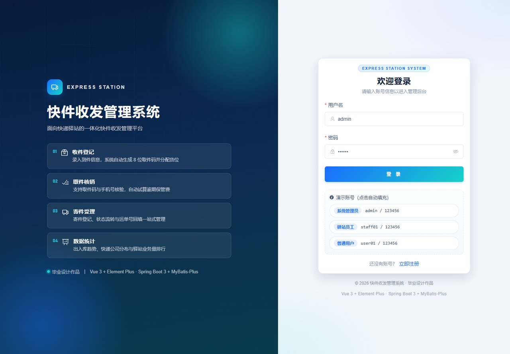
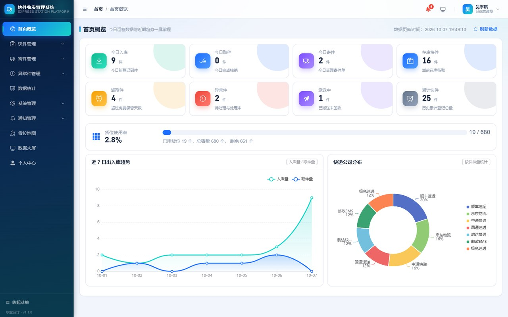
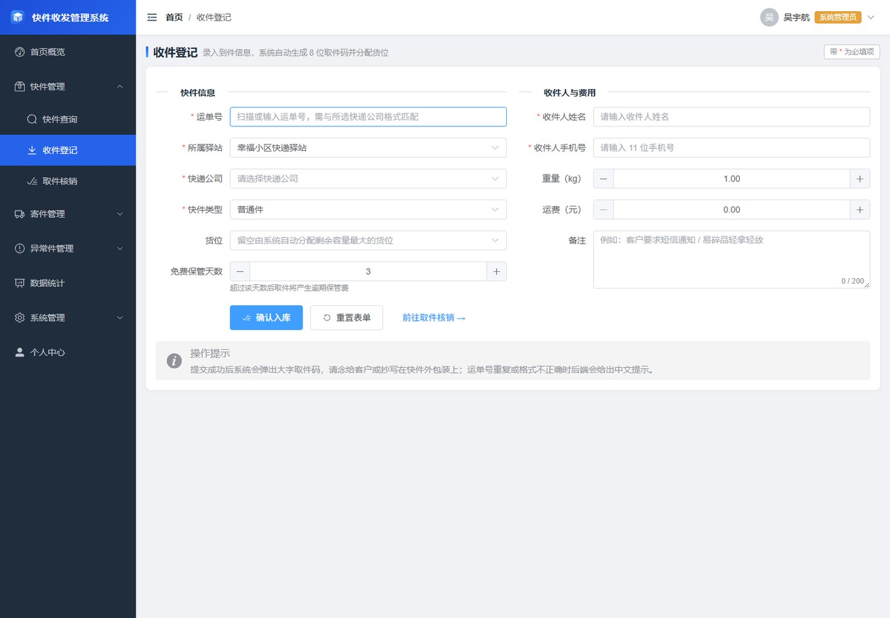
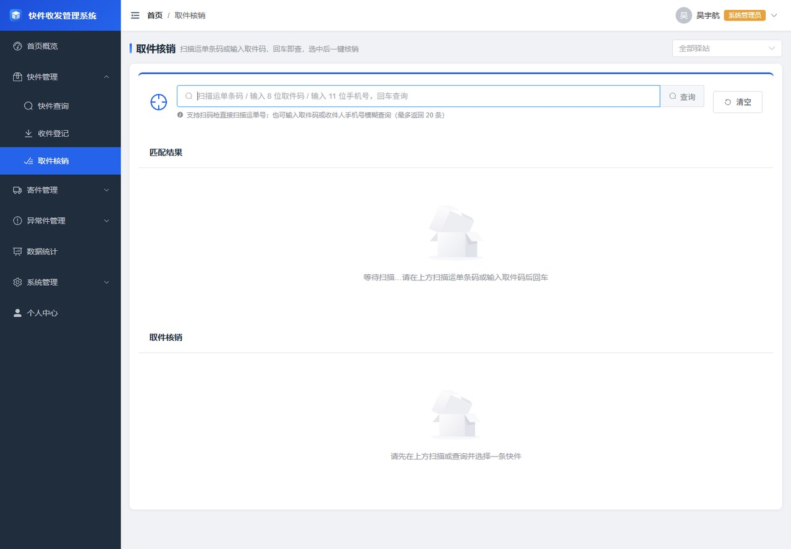
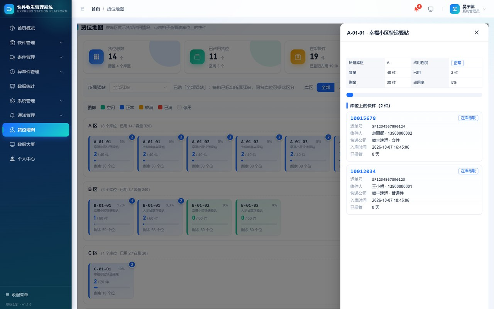
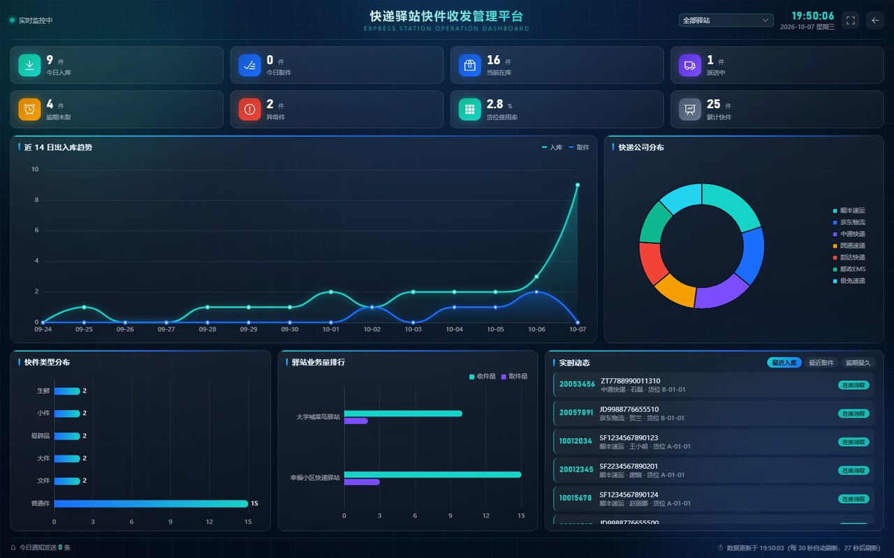
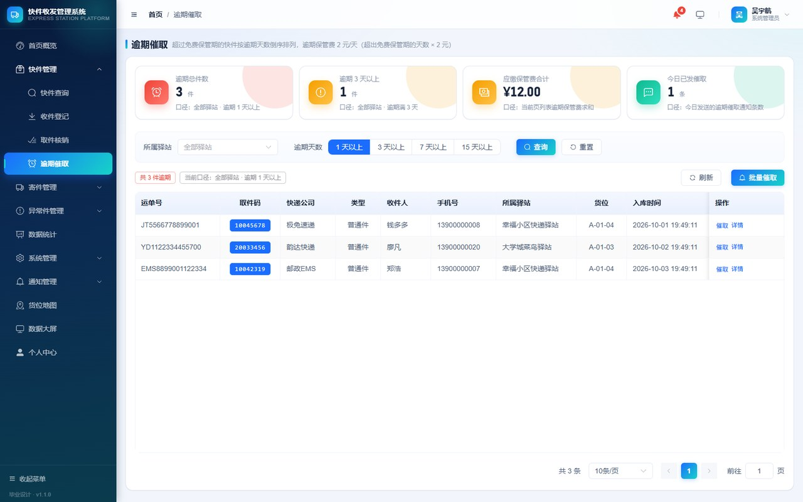
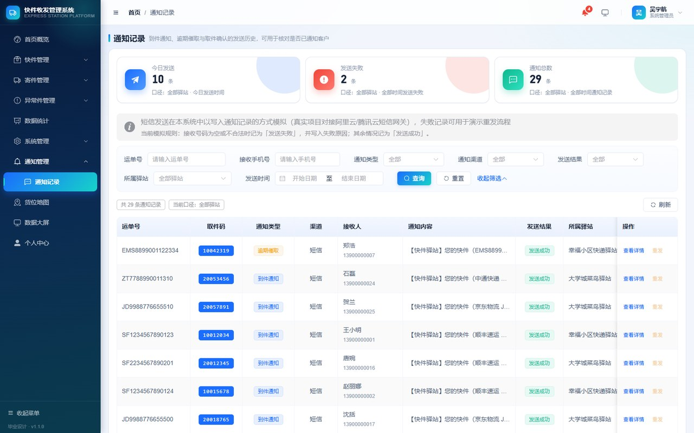

# 面向快递驿站的快件收发管理系统

> 本科毕业设计项目 · 作者：**吴宇航**
> Java 17 + Spring Boot 3 + MyBatis-Plus + MySQL 8 + Vue 3 前后端分离实现

---

## 一、项目简介

本项目面向社区快递驿站的实际业务场景，围绕"快件从进入驿站到交付收件人"的完整链路，
实现 **收件登记 → 到件通知 → 取件核销 → 派送出库 → 寄件受理 → 异常件流转 → 逾期催取 → 台账查询与统计** 的全流程管理。

系统区分 **系统管理员 / 驿站员工 / 普通用户** 三类角色，采用 RBAC 模型做菜单级与按钮级权限控制，
并针对驿站最容易出错的"货位库存一致性"问题做了事务化处理与自检修复能力。

### 核心功能

| 模块 | 功能 |
| ---- | ---- |
| 认证管理 | 用户注册、登录、退出、JWT 令牌签发与校验、获取当前用户与动态菜单 |
| 权限管理 | 角色维护、权限树分配、接口级鉴权（`@RequiresPermission`）、菜单与按钮级前端控制 |
| 收件登记 | 运单号按快递公司正则校验、自动生成 8 位取件码、自动分配/指定货位、轨迹留痕、**入库后自动发送到件通知** |
| 取件核销 | 取件码 + 运单号双重匹配、逾期保管费自动试算、写取件凭证、**同事务释放货位**、**核销后自动发送取件确认** |
| 派送管理 | 在库快件发起派送，状态流转为"派送中"；派送中快件可当面签收核销 |
| 寄件管理 | 寄件登记（自动生成单号）、状态流转（待揽收 → 已揽收 → 已发出 / 已取消）、回填运单号 |
| 异常件管理 | 破损 / 丢失 / 地址错误 / 拒收 / 长期未取 / 其他，单独登记与跟进，可同步快件状态 |
| **通知与催取** | 到件通知 / 逾期催取 / 取件确认 / 异常通知四类通知记录，支持单条发送与**批量催取（同一快件当天自动去重）**、失败原因留痕与重发 |
| **逾期件管理** | 按"至少逾期 N 天"分层列出超期未取快件，按逾期天数倒序，突出应缴保管费 |
| **货位可视化地图** | 按库区铺开货架网格图，格子按占用程度着色（空闲/正常/较满/已满），点击查看该库位上的每件快件 |
| 数据查询 | 运单号、取件码、收件人、手机号、快递公司、状态、类型、驿站、时间区间组合查询 + 分页 |
| 台账导出 | 按当前筛选条件导出 `.xlsx` 快件台账（Apache POI，含表头样式与自适应列宽） |
| 打印取件小票 | 一键打印含大号取件码的取件小票，方便交给客户 |
| 数据统计 | 首页概览指标、近 N 日出入库趋势、快递公司分布、快件类型分布、驿站业务量排行 |
| **数据大屏** | 全屏深色看板，聚合 8 项核心指标 + 3 张图表 + 3 个实时榜单，30 秒自动轮询，适合答辩投屏 |
| **取件码自助查询** | **免登录**页面，收件人输入手机号即可查到自己的取件码（仅返回仍在驿站的快件） |
| 基础数据 | 驿站管理、货架库位管理、货位占用重算（修复历史数据不一致） |

---

## 二、技术栈

### 后端

| 技术 | 版本 | 用途 |
| ---- | ---- | ---- |
| JDK | 17 | 运行环境 |
| Spring Boot | 3.2.5 | 应用框架、自动装配、事务管理 |
| MyBatis-Plus | 3.5.7 | 持久层框架，分页插件、逻辑删除、防全表更新 |
| MySQL | 8.0 | 关系型数据库（13 张表） |
| JJWT | 0.12.5 | JWT 令牌签发与解析（HS256） |
| Spring Security Crypto | 6.x | BCrypt 密码加密（仅引入加密模块，不启用安全过滤器链） |
| Apache POI | 5.2.5 | Excel 台账导出 |
| SpringDoc OpenAPI | 2.5.0 | 在线接口文档（Swagger UI） |
| Lombok | — | 简化实体与 DTO 代码 |

### 前端

| 技术 | 版本 | 用途 |
| ---- | ---- | ---- |
| Vue | 3.5 | 前端框架（组合式 API + `<script setup>`） |
| Vite | 5.4 | 构建工具与开发服务器 |
| Element Plus | 2.8 | UI 组件库 |
| Vue Router | 4.4 | 路由与导航守卫 |
| Pinia | 2.2 | 状态管理（用户信息、权限集合、令牌持久化） |
| axios | 1.7 | HTTP 请求封装与拦截器 |
| ECharts | 5.5 | 统计图表 |

---

## 三、目录结构

```
express-station-management-system/
├── backend/                       # Spring Boot 后端工程
│   ├── pom.xml
│   └── src/main/
│       ├── java/com/wuyuhang/delivery/
│       │   ├── DeliveryApplication.java     # 启动类
│       │   ├── common/                      # 统一响应、异常处理、枚举、工具类
│       │   │   ├── Result.java              # 统一响应体
│       │   │   ├── PageResult.java          # 统一分页结构
│       │   │   ├── GlobalExceptionHandler.java  # 全局异常处理
│       │   │   ├── enums/                   # 状态枚举（含中文名称映射）
│       │   │   └── util/                    # 运单号校验、取件码生成
│       │   ├── config/                      # MyBatis-Plus、WebMvc、Jackson、通用 Bean
│       │   ├── security/                    # JWT、登录拦截器、权限注解与切面
│       │   ├── entity/                      # 13 张表对应实体
│       │   ├── mapper/                      # Mapper 接口
│       │   ├── dto/                         # 请求参数（含 query 子包）
│       │   ├── vo/                          # 响应视图对象
│       │   ├── service/                     # 业务服务
│       │   └── controller/                  # REST 接口
│       └── resources/
│           ├── application.yml              # 应用配置（不含密码）
│           ├── application-dev.yml.example  # 本地数据库配置模板
│           └── mapper/                      # MyBatis XML（复杂关联查询）
├── frontend/                      # Vue 3 前端工程
│   ├── package.json
│   ├── vite.config.js                       # 5173 端口 + /api 代理到 8080
│   └── src/
│       ├── api/                             # 按模块拆分的接口函数（含 notify / public）
│       ├── utils/                           # axios 封装、字典、格式化、下载
│       ├── stores/                          # Pinia 状态
│       ├── router/                          # 路由与全局守卫（含动态模块加载失败自愈）
│       ├── layout/                          # 主布局（渐变侧边栏 + 逾期提醒 + 渲染异常兜底）
│       ├── components/                      # 页面容器、表格、统计卡片、图表、取件小票
│       ├── directives/                      # v-perm 按钮权限指令
│       ├── styles/theme.css                 # 全站主题：设计 token + Element Plus 覆盖 + 动效
│       └── views/                           # 各业务页面（19 个路由页面）
├── sql/
│   ├── 01_schema.sql                        # 建库建表脚本（13 张表）
│   └── 02_data.sql                          # 初始化数据（角色/权限/用户/驿站/货位/快件/通知）
├── docs/
│   ├── spec.md                              # 软件需求规格说明书
│   ├── database-design.md                   # 数据库设计说明书（含 Mermaid ER 图）
│   ├── api-contract.md                      # 前后端接口契约
│   ├── test-cases.md                        # 测试用例说明书（功能 + 接口）
│   └── thesis-outline.md                    # 毕业论文大纲与答辩准备
├── scripts/                       # 一键启动脚本 + 接口冒烟测试脚本
└── README.md
```

---

## 四、快速开始

### 4.1 环境要求

| 组件 | 版本要求 |
| ---- | -------- |
| JDK | 17 及以上 |
| Maven | 3.6+（或直接使用 IDEA 内置 Maven） |
| MySQL | 8.0 |
| Node.js | 18+（推荐 20/22） |

### 4.2 初始化数据库

用 Navicat 或命令行依次执行 `sql` 目录下的两个脚本（**顺序不能颠倒**）：

```bash
mysql -u root -p < sql/01_schema.sql
mysql -u root -p < sql/02_data.sql
```

执行完成后会创建数据库 `express_station`，包含 13 张表与完整示范数据
（5 个用户、3 个角色、43 项权限、2 个驿站、14 个货位、25 件快件、8 张寄件单、3 条异常记录、30 条通知记录）。

Windows 下也可直接双击 `scripts/init-db.bat`（需先按脚本内提示设置密码）。

### 4.3 配置数据库连接

数据库账号密码**不写在版本库中**，而是通过本地配置文件或环境变量提供，二选一：

**方式一（推荐）：本地配置文件**

把 `backend/src/main/resources/application-dev.yml.example` 复制为同目录下的
`application-dev.yml`，然后填写你自己的 MySQL 密码：

```yaml
spring:
  datasource:
    username: root
    password: 你的密码
```

`application-dev.yml` 已被 `.gitignore` 忽略，不会提交到仓库，密码不会被公开。

**方式二：环境变量**

```bash
set MYSQL_USERNAME=root
set MYSQL_PASSWORD=你的密码
```

环境变量优先级高于配置文件。数据库地址、库名等其它参数在
`backend/src/main/resources/application.yml` 中，一般无需修改。

### 4.4 启动后端

```bash
cd backend
mvn spring-boot:run
```

或者用 IDEA 打开 `backend` 目录（作为 Maven 工程导入），直接运行 `DeliveryApplication`。

启动成功后：

- 后端接口地址：<http://localhost:8080/api>
- 在线接口文档：<http://localhost:8080/swagger-ui.html>

Windows 下也可双击 `scripts/start-backend.bat`。

### 4.5 启动前端

```bash
cd frontend
npm install
npm run dev
```

浏览器访问 <http://localhost:5173>。Vite 已配置 `/api` 代理到 `http://localhost:8080`，无需额外跨域配置。

Windows 下也可双击 `scripts/start-frontend.bat`。

### 4.6 演示账号

| 账号 | 密码 | 角色 | 可见范围 |
| ---- | ---- | ---- | -------- |
| `admin` | `123456` | 系统管理员 | 全部功能与全部驿站 |
| `staff01` | `123456` | 驿站员工 | 幸福小区快递驿站（收件 / 取件 / 寄件 / 异常件 / 统计） |
| `staff02` | `123456` | 驿站员工 | 大学城菜鸟驿站 |
| `user01` | `123456` | 普通用户 | 仅本人手机号名下快件的查询 |
| `user02` | `123456` | 普通用户 | 同上 |

> 密码在数据库中以 BCrypt 密文存储，登录时由 `BCryptPasswordEncoder.matches` 校验，不保存明文。

---

## 五、系统设计要点

### 5.1 统一响应体

所有接口返回同一结构，前端只需判断 `code === 200`：

```json
{ "code": 200, "message": "操作成功", "data": {} }
```

状态码约定：`200` 成功、`400` 参数校验失败、`401` 未登录/令牌失效、`403` 无权限、
`404` 资源不存在、`500` 服务器错误、`1001` 可直接展示给用户的业务异常。

### 5.2 认证与鉴权分层

- **认证**（你是谁）：`JwtInterceptor` 校验请求头 `Authorization: Bearer <token>`，
  解析成功后把用户信息写入 `UserContext`（ThreadLocal），请求结束时在 `afterCompletion` 中清理，
  避免 Tomcat 线程复用导致用户信息串号。
- **鉴权**（你能不能做）：`@RequiresPermission` 注解 + `PermissionAspect` 切面，
  由数据库驱动的 RBAC 权限集合判定，业务代码中不出现重复的 if 判断。

### 5.3 货位库存一致性（本项目的重点问题）

驿站业务中最典型的缺陷是"货位占用数量与货架上实际快件数对不上"，本项目从三个层面解决：

1. **同事务**：收件登记（占用货位）与取件核销（释放货位）都在 `@Transactional` 中完成，
   任一步骤失败则整体回滚，不会出现"货位已释放但快件还在架上"。
2. **统一占用口径**：以"快件实体是否仍在货架上"为唯一口径 ——
   `IN_STORE`（在库待取）、`DELIVERING`（派送中，货位仍保留）、`EXCEPTION`（异常件，件还在驿站）
   占用货位；`PICKED_UP`、`RETURNED` 不占用。该口径由 `ParcelService.isShelfOccupied` 统一提供，
   取件、删除、异常件退回、货位重算全部复用。
3. **自检修复**：`PUT /api/shelves/recalculate` 按口径重算全部货位占用数，
   可修复因异常中断（如服务器宕机）造成的历史不一致数据。

此外，占用货位使用「带容量条件的 UPDATE」（`used_count < capacity`）而非"先查后改"，
从数据库层面避免并发入库时超卖。

### 5.4 数据权限

| 角色 | 可见数据范围 |
| ---- | ------------ |
| 系统管理员 | 全部驿站数据，可指定驿站筛选 |
| 驿站员工 | 仅本驿站数据（由后端强制注入 `stationId`，前端无法绕过） |
| 普通用户 | 仅本人手机号名下快件（由后端强制注入 `receiverPhone`） |

### 5.5 数据库设计概要（13 张表）

| 分类 | 表名 | 说明 |
| ---- | ---- | ---- |
| 系统权限 | `sys_user` | 用户（三类角色共用一张表） |
| | `sys_role` | 角色 |
| | `sys_user_role` | 用户-角色关联 |
| | `sys_permission` | 权限（菜单 + 按钮两级粒度） |
| | `sys_role_permission` | 角色-权限关联 |
| 业务核心 | `station` | 驿站（网点） |
| | `shelf` | 货架库位（含占用数量） |
| | `parcel` | 快件主表（核心业务表） |
| | `parcel_trace` | 快件轨迹（操作留痕） |
| | `pickup_record` | 取件记录（业务凭证） |
| | `ship_order` | 寄件登记 |
| | `exception_record` | 异常件记录 |
| | `notify_record` | **取件通知记录**（到件/催取/取件确认/异常，含发送结果与失败原因） |

完整的 ER 图、字段清单与索引设计说明见 [docs/database-design.md](docs/database-design.md)。

### 5.6 消息通知模块的设计（v1.1 新增）

驿站的核心痛点之一是"件到了但客户不知道"。本项目把通知做成**可追溯的业务记录**而不是一次性调用：

- 收件登记成功后，自动写入一条 `IN_STORE`（到件通知）；取件核销成功后，自动写入一条 `PICKUP_DONE`（取件确认）。
  两次自动发送都在业务事务内完成，但 `NotifyService.autoSend` 内部捕获了异常 ——
  **通知发不出去不会导致快件入不了库**，这是有意为之的取舍。
- 手动通知与**批量催取**：批量催取会跳过"同一快件当天已发过逾期通知"的记录，
  避免客户一天收到十几条短信；同时单次批量上限 50 条，防止误操作。
- 发送失败的记录会保留并填写 `failReason`，页面上可以据此重发，便于演示异常处理流程。
- `NotifyService.dispatch()` 是**对接真实短信网关的位置**（如阿里云 dysmsapi）。
  当前以"写入通知记录"的方式模拟发送，答辩演示不产生费用，替换该方法内部实现即可接入真实网关。

### 5.7 公开查询接口的安全设计（v1.1 新增）

`GET /api/public/pickup-query?phone=` 是免登录接口，对应真实驿站"输手机号查取件码"的自助服务。
免登录意味着任何知道手机号的人都能查询，因此在服务层做了三重收敛：

1. **只返回仍在驿站的快件**（`IN_STORE` / `DELIVERING`），已取件与已退回的历史记录一律不返回，
   无法通过该接口探测某号码的历史收件情况；
2. **单次最多返回 20 条**，避免被当作批量数据接口使用；
3. **主动隐藏内部字段**：`PublicService` 在返回前把 `stationId`、`shelfId`、`operatorId`、`freight`、`remark` 置空，
   只保留取件必需的字段（取件码、运单号、库位、驿站名、状态、保管费）。

该接口已在 `WebMvcConfig` 中排除登录拦截，其余 `/api/**` 接口仍然强制校验 JWT。

---

## 六、接口文档

- 前后端接口契约（**开发前必读**）：[docs/api-contract.md](docs/api-contract.md)
- 运行时在线接口文档：<http://localhost:8080/swagger-ui.html>
  使用方式：先调用 `/api/auth/login` 拿到 token，点击右上角 **Authorize** 填入后即可调试其余接口。

---

## 七、测试

| 文档 | 内容 |
| ---- | ---- |
| [docs/test-cases.md](docs/test-cases.md) | 功能测试用例 + 接口测试用例 + 需求覆盖矩阵 |

已完成的自动化验证（接口冒烟测试）：

> 测试脚本随项目一起提供，可复现：先启动后端，再执行
> `powershell -ExecutionPolicy Bypass -File scripts\api-smoke-test.ps1`，
> 结果输出到 `scripts/api-smoke-result.txt`，导出的台账示例为 `scripts/api-smoke-export.xlsx`。

- 认证：登录成功 / 密码错误 / 未携带令牌访问受保护接口 → 401
- 收件登记：正常入库（生成取件码、分配货位）/ 运单号格式错误 / 运单号重复 / 手机号格式错误
- 货位一致性：入库占用 → 异常件仍占用 → 退回释放 → 重算无漂移（全流程逐值核对）
- 取件核销：按取件码查询 / 逾期费试算 / 取件码错误 / 正常核销 / 重复核销被拒 / 轨迹完整
- 派送后核销：`IN_STORE → DELIVERING → PICKED_UP` 全链路与货位释放核对
- 权限控制：员工访问用户管理 → 403；员工访问驿站排行 → 403；普通用户仅能查到本人手机号名下快件
- 寄件与异常件：寄件登记与状态流转、异常件登记（快件同步为异常）、异常件处理（同步为已退回）
- 统计：概览指标、7 日趋势（缺失日期自动补 0）、快递公司分布、类型分布、驿站排行
- 导出：HTTP 200 返回合法 `.xlsx`（18 列 / 数据行数正确）
- 系统管理：用户 / 角色 / 权限树 / 驿站 / 货位增删改查与校验
- **通知模块**：通知记录分页与失败筛选、自动生成通知文案、批量催取、**同日重复催取被跳过**、待催取计数
- **逾期模块**：逾期分页（按逾期天数倒序）、`minDays` 分层筛选、逾期件数量
- **货位地图**：库位占用程度分级（EMPTY/NORMAL/BUSY/FULL）与库位快件挂载
- **数据大屏**：一次聚合请求返回全部指标；**员工不返回驿站排行**
- **公开接口**：免登录可访问、手机号格式校验、无结果兜底、**不泄露 stationId/remark/freight 等内部字段**

---

## 八、说明与已知边界

1. **权限变更生效时机**：角色与权限随 JWT 一起下发，鉴权过程不再查库（提升性能）。
   因此给角色重新分配权限后，相关用户需**重新登录**才会生效。
2. **JWT 无状态退出**：后端不维护令牌黑名单，退出登录由前端清除本地令牌实现。
   如需强制失效，可引入 Redis 保存令牌版本号（本版本未使用 Redis）。
3. **数据库密码**：账号密码通过 `application-dev.yml`（已在 `.gitignore` 中）或
   环境变量 `MYSQL_USERNAME` / `MYSQL_PASSWORD` 提供，**不会进入版本库**。
   部署到服务器时建议直接使用环境变量注入。
4. **逻辑删除与唯一索引**：`parcel.waybill_no` 为全表唯一索引，
   已逻辑删除的运单号仍占用该唯一约束，若需重新入库同一运单号，应先恢复原记录或改用组合唯一索引。
5. **前端主包体积**：Element Plus 采用完整引入（未使用按需自动导入插件），
   构建产物主包约 1.28 MB；生产环境可通过 `unplugin-vue-components` 按需引入进一步优化。
6. **短信为模拟发送**：通知模块以写入 `notify_record` 的方式模拟发送，未接入真实短信网关
   （对接位置见 `NotifyService.dispatch`）。这样既能完整演示通知与催取流程，又不会产生短信费用。
7. **数据大屏为定时轮询**：大屏每 30 秒轮询一次聚合接口，未使用 WebSocket 推送。
   在答辩场景下轮询已足够，实时性要求更高的场景可改为 SSE 或 WebSocket。
8. **公开查询接口的手机号即可信凭据**：`/api/public/pickup-query` 只凭手机号查询，
   与真实驿站自助取件的做法一致；如需更强校验，可增加"短信验证码"或"运单号后四位"二次校验。

---

## 九、前端视觉主题

v1.1 起全站统一为「深蓝渐变 + 青绿点缀」主题，**改配色只需改一个文件**：`frontend/src/styles/theme.css`。

| 内容 | 位置 |
| ---- | ---- |
| 设计 token（色板、圆角、阴影、动效曲线） | `theme.css` 的 `:root` |
| Element Plus 主题覆盖（主色 `#1a6dff`、成功色 `#0fb98f` 及其明暗梯度） | `theme.css` 第 2 节 |
| 组件美化（卡片、表格、表单、按钮、弹窗、分页、标签页、时间轴） | `theme.css` 第 4 节 |
| 品牌专用类（`.es-gradient-text`、`.es-glass`、`.es-top-accent` 等） | `theme.css` 第 5 节 |
| 侧边栏渐变、布局结构 | `frontend/src/layout/index.vue` |
| 数据大屏的深色配色 | `frontend/src/views/screen/index.vue`（局部样式） |

另有一处**渲染容错**设计：`layout/index.vue` 用 `onErrorCaptured` 捕获子组件异常并展示友好错误页，
`router/index.js` 用 `router.onError` 捕获"动态模块加载失败"（页面 chunk 失效）并自动刷新一次，
避免出现内容区一片空白却没有任何提示的情况。

---

## 十、文档索引

| 文档 | 说明 |
| ---- | ---- |
| [docs/spec.md](docs/spec.md) | 软件需求规格说明书（角色分析、业务流程、功能需求、用例描述） |
| [docs/database-design.md](docs/database-design.md) | 数据库设计说明书（ER 图、13 张表字段、索引设计与设计取舍） |
| [docs/api-contract.md](docs/api-contract.md) | 前后端接口契约（统一约定、全部接口、枚举与错误码） |
| [docs/test-cases.md](docs/test-cases.md) | 测试用例说明书（功能用例、接口用例、覆盖矩阵） |
| [docs/thesis-outline.md](docs/thesis-outline.md) | 毕业论文大纲、写作素材、参考文献与答辩准备 |
| [docs/code-guide.md](docs/code-guide.md) | **源码导读**：先读哪个文件、核心逻辑在第几行、三条主链路、改需求动哪个文件 |
| [docs/screenshots/](docs/screenshots/) | **系统运行截图 13 张**（可直接用于论文第 5 章与答辩 PPT） |

---

## 十一、系统运行截图

以下截图取自真实运行中的系统（完整说明与采集环境见 [docs/screenshots/README.md](docs/screenshots/README.md)）。

| 登录 | 首页概览 | 收件登记 |
| ---- | -------- | -------- |
|  |  |  |

| 取件核销 | 货位地图与库位详情 | 数据大屏 |
| -------- | ------------------ | -------- |
|  |  |  |

| 逾期催取 | 通知记录 | 取件码自助查询 |
| -------- | -------- | -------------- |
|  |  |  |

---

## 十二、作者

**吴宇航** · 本科毕业设计

技术栈：Java / Spring Boot / MyBatis-Plus / MySQL / Vue 3 / Element Plus
