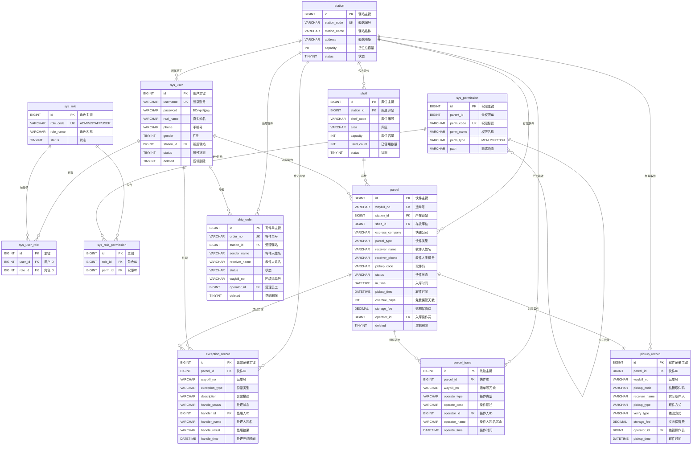

# 面向快递驿站的快件收发管理系统 数据库设计说明书

| 项目名称 | 面向快递驿站的快件收发管理系统 |
| -------- | ------------------------------ |
| 文档名称 | 数据库设计说明书 |
| 作者 | 吴宇航 |
| 版本 | V1.0 |
| 数据库管理系统 | MySQL 8.0 |
| 数据库名 | `express_station` |
| 字符集 / 排序规则 | `utf8mb4` / `utf8mb4_general_ci` |
| 存储引擎 | InnoDB |
| 表数量 | 12 张（5 张系统权限表 + 7 张业务表） |

---

## 1 设计原则与命名规范

### 1.1 设计原则

1. **权限与业务分离**：将与身份认证、授权相关的表统一以 `sys_` 前缀命名，集中为 5 张表；与快件收发业务相关的表单独组织为 7 张表。两类表在逻辑上通过 `user_id`、`operator_id`、`station_id` 等字段关联，便于权限模块独立演进。
2. **满足第三范式并适度冗余**：主数据与关联数据通过主键关联，消除传递依赖。在查询频繁且业务语义明确的场景下允许冗余，例如 `parcel_trace` 冗余 `waybill_no` 与 `operator_name`，`pickup_record` 冗余 `waybill_no`、`pickup_code`、`operator_name`，以减少多表连接、提升查询效率并固化业务发生时的现场信息。
3. **主键统一策略**：所有表使用 `BIGINT` 类型的自增主键 `id`，与后端 Java 的 `Long` 类型一一对应；业务编号（如 `waybill_no`、`order_no`、`station_code`、`shelf_code`）通过唯一索引单独约束，不用作物理主键，保证业务编号变化时不影响关联关系。
4. **状态使用可读枚举**：业务状态统一使用 `VARCHAR` 存储大写字符串枚举值（如 `IN_STORE`、`PICKED_UP`、`PENDING`），不使用数字编码，使数据库记录具备自解释能力，便于直接排查问题与导出报表。
5. **逻辑删除优先**：对需要保留历史痕迹的核心业务表（`sys_user`、`parcel`、`ship_order`）设置 `deleted` 字段，删除操作仅置标记位，不进行物理删除。
6. **时间字段规范**：所有表包含 `create_time`，需要跟踪变更的表额外包含 `update_time`；业务发生时间（`in_time`、`pickup_time`、`operate_time`、`handle_time`）与记录创建时间分离存储，以区分业务时间与系统写入时间。
7. **审计可追溯**：关键业务表记录操作人 `operator_id` 与操作人姓名快照，配合 `parcel_trace` 轨迹表形成完整的操作审计链。
8. **索引服务查询**：索引依据实际查询条件设计，遵循最左前缀原则，优先为高频等值条件与范围条件建立索引，避免为低选择性字段重复建索引。

### 1.2 命名规范

| 对象 | 规范 | 示例 |
| ---- | ---- | ---- |
| 数据库名 | 小写下划线，语义化业务域 | `express_station` |
| 表名 | 小写下划线，单数名词；权限表加 `sys_` 前缀 | `sys_user`、`parcel`、`parcel_trace` |
| 字段名 | 小写下划线，语义清晰不使用缩写歧义 | `receiver_phone`、`handle_status` |
| 主键 | 统一为 `id` | `id` |
| 外键列 | 关联表名或语义加 `_id` | `station_id`、`parcel_id`、`operator_id` |
| 主键索引 | `PRIMARY` | `PRIMARY KEY (id)` |
| 唯一索引 | `uk_` 前缀 + 表意 | `uk_user_username`、`uk_parcel_waybill` |
| 普通索引 | `idx_` 前缀 + 表意 | `idx_parcel_station_status` |
| 状态字段 | 统一命名为 `status` 或 `xxx_status` | `sys_user.status`、`handle_status` |
| 时间字段 | `_time` 结尾；创建更新为 `create_time`、`update_time` | `in_time`、`handle_time` |
| 布尔语义字段 | 使用 `TINYINT`，0/1 表示 | `deleted`、`status` |

### 1.3 数据类型选用说明

| 数据类型 | 使用场景 | 说明 |
| -------- | -------- | ---- |
| `BIGINT` | 主键、关联外键 | 保证与 Java `Long` 对应，预留增长空间 |
| `INT` | 容量、数量、排序号 | 取值范围满足业务需要 |
| `TINYINT` | 状态位、性别、逻辑删除标记 | 取值 0/1 或 0/1/2，节省空间 |
| `DECIMAL(8,2)` | 重量、运费、保管费 | 定点数避免浮点误差，支持两位小数 |
| `DECIMAL(10,2)` | 保价金额 | 金额上限更高，支持两位小数 |
| `VARCHAR(n)` | 名称、编号、描述、手机号 | 按实际长度设定，避免过度冗余 |
| `DATETIME` | 业务时间与审计时间 | 记录精确时间，默认值 `CURRENT_TIMESTAMP` |

---

## 2 概念结构设计

### 2.1 实体识别

依据需求分析，系统抽象出 12 个实体，并划分为两个实体群：

**系统权限实体群**：用户（`sys_user`）、角色（`sys_role`）、用户角色关联（`sys_user_role`）、权限（`sys_permission`）、角色权限关联（`sys_role_permission`）。

**业务实体群**：驿站（`station`）、货架库位（`shelf`）、快件（`parcel`）、快件轨迹（`parcel_trace`）、取件记录（`pickup_record`）、寄件单（`ship_order`）、异常件记录（`exception_record`）。

### 2.2 实体—联系图（ER 图）

### 2.3 联系类型说明

| 联系 | 参与实体 | 类型 | 说明 |
| ---- | -------- | ---- | ---- |
| 用户—角色 | `sys_user` ↔ `sys_role` | 多对多 | 通过 `sys_user_role` 实现；唯一索引 `uk_user_role(user_id, role_id)` 防止重复授权 |
| 角色—权限 | `sys_role` ↔ `sys_permission` | 多对多 | 通过 `sys_role_permission` 实现；唯一索引 `uk_role_perm(role_id, perm_id)` 防止重复授权 |
| 权限自关联 | `sys_permission` → `sys_permission` | 一对多 | `parent_id` 指向父权限，`parent_id = 0` 表示顶级菜单，用于构建菜单树 |
| 驿站—用户 | `station` → `sys_user` | 一对多 | `sys_user.station_id` 标识员工所属驿站，`NULL` 表示不限驿站（如系统管理员） |
| 驿站—货位 | `station` → `shelf` | 一对多 | 一个驿站拥有多个货架库位，同一驿站内 `shelf_code` 唯一 |
| 驿站—快件 | `station` → `parcel` | 一对多 | 一票快件在某一时刻只属于一个驿站 |
| 驿站—寄件单 | `station` → `ship_order` | 一对多 | 寄件单记录受理驿站 |
| 货位—快件 | `shelf` → `parcel` | 一对多 | 一个货位可存放多件快件，`parcel.shelf_id` 允许为空（已退回或待分配） |
| 快件—轨迹 | `parcel` → `parcel_trace` | 一对多 | 一票快件在生命周期内产生多条操作轨迹 |
| 快件—取件记录 | `parcel` → `pickup_record` | 一对一 | 成功核销产生且仅产生一条取件记录 |
| 快件—异常记录 | `parcel` → `exception_record` | 一对多 | 一票快件可能先后出现多次异常情况 |
| 用户—业务操作 | `sys_user` → `parcel` / `ship_order` / `exception_record` | 一对多 | 通过 `operator_id`、`handler_id` 记录操作人 |

### 2.4 参照完整性的实现方式

`01_schema.sql` 未创建物理外键（`FOREIGN KEY`）约束，脚本中以 `SET FOREIGN_KEY_CHECKS = 0` 包裹建表语句，各关联字段仅建立普通索引。参照完整性由应用层与索引共同保证：

1. 关联写入前由 Service 层校验被引用记录是否存在，例如收件登记前校验 `station`、`shelf` 存在且可用。
2. 关联字段全部建立索引（如 `idx_user_station`、`idx_shelf_station`、`idx_trace_parcel`），保证关联查询效率。
3. 删除操作采用逻辑删除，避免因物理删除导致台账断链。
4. 采用应用层校验的动因在于：便于按测试与演示需要批量重置数据（`02_data.sql` 以 `DELETE` + `INSERT` 方式重建数据），同时避免外键级联对业务事务的额外锁定开销。

---

## 3 逻辑结构设计

### 3.1 用户表 `sys_user`

系统管理员、驿站员工与普通用户三类角色共用一张用户表，通过角色关联区分身份。

| 字段名 | 数据类型 | 长度 | 是否为空 | 默认值 | 键 | 说明 |
| ------ | -------- | ---- | -------- | ------ | -- | ---- |
| id | BIGINT | — | NOT NULL | AUTO_INCREMENT | PK | 用户主键 |
| username | VARCHAR | 50 | NOT NULL | — | UK `uk_user_username` | 登录账号 |
| password | VARCHAR | 100 | NOT NULL | — | | 密码（BCrypt 加密存储） |
| real_name | VARCHAR | 50 | NOT NULL | — | | 真实姓名 |
| phone | VARCHAR | 20 | NULL | NULL | IDX `idx_user_phone` | 手机号 |
| gender | TINYINT | — | NOT NULL | 0 | | 性别：0 未知 1 男 2 女 |
| avatar | VARCHAR | 255 | NULL | NULL | | 头像地址 |
| station_id | BIGINT | — | NULL | NULL | IDX `idx_user_station` | 所属驿站（员工/管理员） |
| status | TINYINT | — | NOT NULL | 1 | IDX `idx_user_status` | 账号状态：1 正常 0 禁用 |
| last_login_time | DATETIME | — | NULL | NULL | | 最近登录时间 |
| create_time | DATETIME | — | NOT NULL | CURRENT_TIMESTAMP | | 创建时间 |
| update_time | DATETIME | — | NOT NULL | CURRENT_TIMESTAMP ON UPDATE CURRENT_TIMESTAMP | | 更新时间 |
| deleted | TINYINT | — | NOT NULL | 0 | | 逻辑删除：0 未删除 1 已删除 |

### 3.2 角色表 `sys_role`

| 字段名 | 数据类型 | 长度 | 是否为空 | 默认值 | 键 | 说明 |
| ------ | -------- | ---- | -------- | ------ | -- | ---- |
| id | BIGINT | — | NOT NULL | AUTO_INCREMENT | PK | 角色主键 |
| role_code | VARCHAR | 50 | NOT NULL | — | UK `uk_role_code` | 角色编码：ADMIN/STAFF/USER |
| role_name | VARCHAR | 50 | NOT NULL | — | | 角色名称 |
| description | VARCHAR | 255 | NULL | NULL | | 角色描述 |
| sort | INT | — | NOT NULL | 0 | | 排序号 |
| status | TINYINT | — | NOT NULL | 1 | | 状态：1 启用 0 停用 |
| create_time | DATETIME | — | NOT NULL | CURRENT_TIMESTAMP | | 创建时间 |

初始化数据：`ADMIN` 系统管理员、`STAFF` 驿站员工、`USER` 普通用户，排序号分别为 1、2、3，状态均为启用。

### 3.3 用户角色关联表 `sys_user_role`

| 字段名 | 数据类型 | 长度 | 是否为空 | 默认值 | 键 | 说明 |
| ------ | -------- | ---- | -------- | ------ | -- | ---- |
| id | BIGINT | — | NOT NULL | AUTO_INCREMENT | PK | 主键 |
| user_id | BIGINT | — | NOT NULL | — | UK `uk_user_role` 联合列 | 用户ID |
| role_id | BIGINT | — | NOT NULL | — | UK `uk_user_role` 联合列；IDX `idx_ur_role` | 角色ID |

唯一索引 `uk_user_role(user_id, role_id)` 保证同一用户对同一角色不重复授权。`idx_ur_role(role_id)` 支持按角色反查用户。

### 3.4 权限表 `sys_permission`

权限表同时承载菜单（`MENU`）与按钮（`BUTTON`）两类权限记录，通过 `parent_id` 组织为树形结构。

| 字段名 | 数据类型 | 长度 | 是否为空 | 默认值 | 键 | 说明 |
| ------ | -------- | ---- | -------- | ------ | -- | ---- |
| id | BIGINT | — | NOT NULL | AUTO_INCREMENT | PK | 权限主键 |
| parent_id | BIGINT | — | NOT NULL | 0 | IDX `idx_perm_parent` | 父权限ID，0 表示顶级 |
| perm_code | VARCHAR | 80 | NOT NULL | — | UK `uk_perm_code` | 权限标识，如 parcel:create |
| perm_name | VARCHAR | 50 | NOT NULL | — | | 权限名称 |
| perm_type | VARCHAR | 10 | NOT NULL | 'MENU' | | 类型：MENU 菜单 BUTTON 按钮 |
| path | VARCHAR | 120 | NULL | NULL | | 前端路由地址 |
| icon | VARCHAR | 50 | NULL | NULL | | 菜单图标 |
| sort | INT | — | NOT NULL | 0 | | 排序号 |
| status | TINYINT | — | NOT NULL | 1 | | 状态：1 启用 0 停用 |
| create_time | DATETIME | — | NOT NULL | CURRENT_TIMESTAMP | | 创建时间 |

初始化权限共 35 条（其中菜单类 12 条、按钮类 23 条），按顶级菜单组织为：`dashboard` 首页概览；`parcel` 快件管理（含 `parcel:list`、`parcel:in`、`parcel:pickup` 三个菜单与 `parcel:deliver`、`parcel:edit`、`parcel:delete`、`parcel:export`、`parcel:trace` 五个按钮）；`ship` 寄件管理（含 `ship:list` 菜单与 `ship:add`、`ship:edit`、`ship:delete`、`ship:status` 四个按钮）；`exception` 异常件管理（含 `exception:list` 菜单与 `exception:add`、`exception:handle` 两个按钮）；`stats` 数据统计（含 `stats:view` 按钮）；`system` 系统管理（含 `system:user:list`、`system:role:list`、`system:station:list`、`system:shelf:list` 四个菜单与对应按钮）；`profile` 个人中心。

### 3.5 角色权限关联表 `sys_role_permission`

| 字段名 | 数据类型 | 长度 | 是否为空 | 默认值 | 键 | 说明 |
| ------ | -------- | ---- | -------- | ------ | -- | ---- |
| id | BIGINT | — | NOT NULL | AUTO_INCREMENT | PK | 主键 |
| role_id | BIGINT | — | NOT NULL | — | UK `uk_role_perm` 联合列 | 角色ID |
| perm_id | BIGINT | — | NOT NULL | — | UK `uk_role_perm` 联合列；IDX `idx_rp_perm` | 权限ID |

权限分配初始化规则：`ADMIN`（role_id = 1）拥有全部权限；`STAFF`（role_id = 2）拥有除系统管理与删除快件、删除寄件单之外的全部业务权限，具体权限 id 集合为 1、10、11、12、13、14、15、17、18、20、21、22、23、25、30、31、32、33、40、41、70；`USER`（role_id = 3）仅拥有首页概览、快件查询与个人中心三项权限，对应权限 id 为 1、11、70。

### 3.6 驿站表 `station`

| 字段名 | 数据类型 | 长度 | 是否为空 | 默认值 | 键 | 说明 |
| ------ | -------- | ---- | -------- | ------ | -- | ---- |
| id | BIGINT | — | NOT NULL | AUTO_INCREMENT | PK | 驿站主键 |
| station_code | VARCHAR | 32 | NOT NULL | — | UK `uk_station_code` | 驿站编号 |
| station_name | VARCHAR | 80 | NOT NULL | — | | 驿站名称 |
| address | VARCHAR | 255 | NOT NULL | — | | 驿站地址 |
| contact_phone | VARCHAR | 20 | NULL | NULL | | 联系电话 |
| manager_name | VARCHAR | 50 | NULL | NULL | | 负责人 |
| business_hours | VARCHAR | 60 | NULL | '08:00-21:00' | | 营业时间 |
| capacity | INT | — | NOT NULL | 500 | | 货位总容量 |
| status | TINYINT | — | NOT NULL | 1 | | 状态：1 营业 0 停用 |
| create_time | DATETIME | — | NOT NULL | CURRENT_TIMESTAMP | | 创建时间 |
| update_time | DATETIME | — | NOT NULL | CURRENT_TIMESTAMP ON UPDATE CURRENT_TIMESTAMP | | 更新时间 |

### 3.7 货架库位表 `shelf`

| 字段名 | 数据类型 | 长度 | 是否为空 | 默认值 | 键 | 说明 |
| ------ | -------- | ---- | -------- | ------ | -- | ---- |
| id | BIGINT | — | NOT NULL | AUTO_INCREMENT | PK | 库位主键 |
| station_id | BIGINT | — | NOT NULL | — | UK `uk_shelf_code` 联合列；IDX `idx_shelf_station` | 所属驿站 |
| shelf_code | VARCHAR | 32 | NOT NULL | — | UK `uk_shelf_code` 联合列 | 库位编号，如 A-01-01 |
| area | VARCHAR | 20 | NULL | NULL | | 库区，如 A/B/C |
| capacity | INT | — | NOT NULL | 40 | | 库位容量（件） |
| used_count | INT | — | NOT NULL | 0 | | 已使用数量（件） |
| status | TINYINT | — | NOT NULL | 1 | | 状态：1 可用 0 停用 |
| create_time | DATETIME | — | NOT NULL | CURRENT_TIMESTAMP | | 创建时间 |
| update_time | DATETIME | — | NOT NULL | CURRENT_TIMESTAMP ON UPDATE CURRENT_TIMESTAMP | | 更新时间 |

唯一索引 `uk_shelf_code(station_id, shelf_code)` 保证同一驿站内库位编号唯一，不同驿站的库位可使用相同编号（如驿站 1 与驿站 2 均存在 `A-01-01`）。`used_count` 由业务操作维护，取值为该货位上 `deleted = 0` 且 `status` 属于 `IN_STORE`、`DELIVERING`、`EXCEPTION` 的快件数量，即以「快件实体是否仍在货架上」为统一口径：在库待取、派送中（货位仍为其保留）、异常件（件还留在驿站）均占用库位，已取件与已退回的快件不再占用库位。取件核销、删除快件与异常件退回时都会释放对应库位，`ShelfMapper.recalcUsedCount` 可按此口径重算历史数据。

### 3.8 快件表 `parcel`

系统的核心业务表，记录每一票快件的静态信息与当前状态。

| 字段名 | 数据类型 | 长度 | 是否为空 | 默认值 | 键 | 说明 |
| ------ | -------- | ---- | -------- | ------ | -- | ---- |
| id | BIGINT | — | NOT NULL | AUTO_INCREMENT | PK | 快件主键 |
| waybill_no | VARCHAR | 40 | NOT NULL | — | UK `uk_parcel_waybill` | 快递运单号 |
| station_id | BIGINT | — | NOT NULL | — | IDX `idx_parcel_station_status` 联合列 | 所在驿站 |
| shelf_id | BIGINT | — | NULL | NULL | | 存放库位 |
| express_company | VARCHAR | 40 | NOT NULL | — | | 快递公司 |
| parcel_type | VARCHAR | 20 | NOT NULL | 'NORMAL' | | 快件类型：NORMAL 普通 SMALL 小件 LARGE 大件 FRAGILE 易碎 DOCUMENT 文件 COLD 生鲜 |
| receiver_name | VARCHAR | 50 | NOT NULL | — | | 收件人姓名 |
| receiver_phone | VARCHAR | 20 | NOT NULL | — | IDX `idx_parcel_receiver_phone` | 收件人手机号 |
| pickup_code | VARCHAR | 10 | NOT NULL | — | IDX `idx_parcel_pickup_code` | 取件码（8 位数字） |
| weight | DECIMAL | (8,2) | NULL | NULL | | 重量(kg) |
| freight | DECIMAL | (8,2) | NULL | NULL | | 代收运费(元) |
| status | VARCHAR | 20 | NOT NULL | 'IN_STORE' | IDX `idx_parcel_station_status` 联合列 | 状态：IN_STORE 在库 PICKED_UP 已取件 DELIVERING 派送中 EXCEPTION 异常 RETURNED 已退回 |
| in_time | DATETIME | — | NOT NULL | — | IDX `idx_parcel_in_time` | 入库时间 |
| pickup_time | DATETIME | — | NULL | NULL | | 取件/签收时间 |
| overdue_days | INT | — | NOT NULL | 3 | | 免费保管天数 |
| storage_fee | DECIMAL | (8,2) | NOT NULL | 0.00 | | 逾期保管费(元) |
| operator_id | BIGINT | — | NULL | NULL | | 入库操作员 |
| remark | VARCHAR | 255 | NULL | NULL | | 备注 |
| create_time | DATETIME | — | NOT NULL | CURRENT_TIMESTAMP | | 创建时间 |
| update_time | DATETIME | — | NOT NULL | CURRENT_TIMESTAMP ON UPDATE CURRENT_TIMESTAMP | | 更新时间 |
| deleted | TINYINT | — | NOT NULL | 0 | | 逻辑删除：0 未删除 1 已删除 |

状态流转规则：`IN_STORE`（在库待取）可流转至 `PICKED_UP`、`DELIVERING` 或 `EXCEPTION`；`DELIVERING`（派送中）可流转至 `PICKED_UP` 或 `EXCEPTION`；`EXCEPTION`（异常件）可流转至 `RETURNED` 或恢复为 `IN_STORE`；`RETURNED`（已退回）为终态。

### 3.9 快件轨迹表 `parcel_trace`

| 字段名 | 数据类型 | 长度 | 是否为空 | 默认值 | 键 | 说明 |
| ------ | -------- | ---- | -------- | ------ | -- | ---- |
| id | BIGINT | — | NOT NULL | AUTO_INCREMENT | PK | 轨迹主键 |
| parcel_id | BIGINT | — | NOT NULL | — | IDX `idx_trace_parcel` | 快件ID |
| waybill_no | VARCHAR | 40 | NOT NULL | — | IDX `idx_trace_waybill` | 运单号（冗余，便于查询） |
| operate_type | VARCHAR | 30 | NOT NULL | — | | 操作类型：IN_STORE/PICKUP/DELIVER/EXCEPTION/RETURN/TRANSFER/EDIT |
| operate_desc | VARCHAR | 255 | NULL | NULL | | 操作描述 |
| station_id | BIGINT | — | NULL | NULL | | 操作驿站 |
| operator_id | BIGINT | — | NULL | NULL | | 操作人ID |
| operator_name | VARCHAR | 50 | NULL | NULL | | 操作人姓名（冗余） |
| operate_time | DATETIME | — | NOT NULL | CURRENT_TIMESTAMP | IDX `idx_trace_time` | 操作时间 |

轨迹表只增不改，形成快件全生命周期的操作流水。`operate_type` 覆盖入库（`IN_STORE`）、取件（`PICKUP`）、派送（`DELIVER`）、异常（`EXCEPTION`）、退回（`RETURN`）、转站（`TRANSFER`）与编辑（`EDIT`）七类操作。

### 3.10 取件记录表 `pickup_record`

| 字段名 | 数据类型 | 长度 | 是否为空 | 默认值 | 键 | 说明 |
| ------ | -------- | ---- | -------- | ------ | -- | ---- |
| id | BIGINT | — | NOT NULL | AUTO_INCREMENT | PK | 取件记录主键 |
| parcel_id | BIGINT | — | NOT NULL | — | IDX `idx_pickup_parcel` | 快件ID |
| waybill_no | VARCHAR | 40 | NOT NULL | — | IDX `idx_pickup_waybill` | 运单号 |
| pickup_code | VARCHAR | 10 | NOT NULL | — | | 核销取件码 |
| receiver_name | VARCHAR | 50 | NOT NULL | — | | 实际取件人 |
| receiver_phone | VARCHAR | 20 | NULL | NULL | | 取件人手机号 |
| pickup_type | VARCHAR | 20 | NOT NULL | 'SELF' | | 取件方式：SELF 本人自取 AGENT 代取 DELIVERY 送货上门 |
| verify_type | VARCHAR | 20 | NOT NULL | 'CODE' | | 核验方式：CODE 取件码 ID_CARD 身份证 PHONE 手机号 |
| storage_fee | DECIMAL | (8,2) | NOT NULL | 0.00 | | 实收保管费(元) |
| station_id | BIGINT | — | NULL | NULL | | 驿站 |
| operator_id | BIGINT | — | NULL | NULL | | 核销操作员 |
| operator_name | VARCHAR | 50 | NULL | NULL | | 核销操作员姓名 |
| pickup_time | DATETIME | — | NOT NULL | CURRENT_TIMESTAMP | IDX `idx_pickup_time` | 取件时间 |
| remark | VARCHAR | 255 | NULL | NULL | | 备注 |

该表记录交付现场信息：`receiver_name` 记录实际取件人，与 `parcel.receiver_name`（登记时的收件人）可能不同，以支持代取与送货上门场景；`pickup_code` 固化核销时使用的取件码，形成不可篡改的凭据留痕。

### 3.11 寄件登记表 `ship_order`

| 字段名 | 数据类型 | 长度 | 是否为空 | 默认值 | 键 | 说明 |
| ------ | -------- | ---- | -------- | ------ | -- | ---- |
| id | BIGINT | — | NOT NULL | AUTO_INCREMENT | PK | 寄件单主键 |
| order_no | VARCHAR | 40 | NOT NULL | — | UK `uk_ship_order_no` | 寄件单号（S+时间戳） |
| station_id | BIGINT | — | NOT NULL | — | IDX `idx_ship_station` | 受理驿站 |
| express_company | VARCHAR | 40 | NOT NULL | — | | 快递公司 |
| sender_name | VARCHAR | 50 | NOT NULL | — | | 寄件人姓名 |
| sender_phone | VARCHAR | 20 | NOT NULL | — | | 寄件人手机号 |
| sender_address | VARCHAR | 255 | NOT NULL | — | | 寄件人地址 |
| receiver_name | VARCHAR | 50 | NOT NULL | — | | 收件人姓名 |
| receiver_phone | VARCHAR | 20 | NOT NULL | — | | 收件人手机号 |
| receiver_address | VARCHAR | 255 | NOT NULL | — | | 收件人地址 |
| parcel_type | VARCHAR | 20 | NOT NULL | 'NORMAL' | | 快件类型 |
| weight | DECIMAL | (8,2) | NULL | NULL | | 重量(kg) |
| freight | DECIMAL | (8,2) | NOT NULL | 0.00 | | 运费(元) |
| insured_value | DECIMAL | (10,2) | NULL | 0.00 | | 保价金额(元) |
| status | VARCHAR | 20 | NOT NULL | 'PENDING' | IDX `idx_ship_status` | 状态：PENDING 待揽收 ACCEPTED 已揽收 SHIPPED 已发出 CANCELLED 已取消 |
| waybill_no | VARCHAR | 40 | NULL | NULL | | 回填的运单号 |
| operator_id | BIGINT | — | NULL | NULL | | 受理员工 |
| create_time | DATETIME | — | NOT NULL | CURRENT_TIMESTAMP | IDX `idx_ship_create_time` | 登记时间 |
| update_time | DATETIME | — | NOT NULL | CURRENT_TIMESTAMP ON UPDATE CURRENT_TIMESTAMP | | 更新时间 |
| deleted | TINYINT | — | NOT NULL | 0 | | 逻辑删除：0 未删除 1 已删除 |

`order_no` 由后端生成，规则为字符 `S` 加 14 位时间戳（`yyyyMMddHHmmss`）加 2 位随机数；唯一索引 `uk_ship_order_no` 保证单号不冲突。`waybill_no` 在寄件单进入 `ACCEPTED` 状态时由员工回填。

### 3.12 异常件记录表 `exception_record`

| 字段名 | 数据类型 | 长度 | 是否为空 | 默认值 | 键 | 说明 |
| ------ | -------- | ---- | -------- | ------ | -- | ---- |
| id | BIGINT | — | NOT NULL | AUTO_INCREMENT | PK | 异常记录主键 |
| parcel_id | BIGINT | — | NOT NULL | — | IDX `idx_exception_parcel` | 快件ID |
| waybill_no | VARCHAR | 40 | NOT NULL | — | | 运单号 |
| exception_type | VARCHAR | 30 | NOT NULL | — | IDX `idx_exception_type` | 异常类型：DAMAGED 破损 LOST 丢失 ADDRESS_ERROR 地址错误 REFUSED 拒收 TIMEOUT 长期未取 OTHER 其他 |
| description | VARCHAR | 255 | NULL | NULL | | 异常描述 |
| handle_status | VARCHAR | 20 | NOT NULL | 'PENDING' | IDX `idx_exception_status` | 处理状态：PENDING 待处理 HANDLING 处理中 RESOLVED 已解决 |
| handler_id | BIGINT | — | NULL | NULL | | 处理人ID |
| handler_name | VARCHAR | 50 | NULL | NULL | | 处理人姓名 |
| handle_result | VARCHAR | 255 | NULL | NULL | | 处理结果 |
| station_id | BIGINT | — | NULL | NULL | | 驿站 |
| create_time | DATETIME | — | NOT NULL | CURRENT_TIMESTAMP | | 登记时间 |
| handle_time | DATETIME | — | NULL | NULL | | 处理完成时间 |

### 3.13 表清单汇总

| 序号 | 表名 | 中文名 | 类别 | 主键 | 唯一索引 | 普通索引数 |
| ---- | ---- | ------ | ---- | ---- | -------- | ---------- |
| 1 | sys_user | 用户表 | 权限 | id | uk_user_username | 3 |
| 2 | sys_role | 角色表 | 权限 | id | uk_role_code | 0 |
| 3 | sys_user_role | 用户角色关联表 | 权限 | id | uk_user_role | 1 |
| 4 | sys_permission | 权限表 | 权限 | id | uk_perm_code | 1 |
| 5 | sys_role_permission | 角色权限关联表 | 权限 | id | uk_role_perm | 1 |
| 6 | station | 驿站表 | 业务 | id | uk_station_code | 0 |
| 7 | shelf | 货架库位表 | 业务 | id | uk_shelf_code | 1 |
| 8 | parcel | 快件表 | 业务 | id | uk_parcel_waybill | 4 |
| 9 | parcel_trace | 快件轨迹表 | 业务 | id | — | 3 |
| 10 | pickup_record | 取件记录表 | 业务 | id | — | 3 |
| 11 | ship_order | 寄件登记表 | 业务 | id | uk_ship_order_no | 3 |
| 12 | exception_record | 异常件记录表 | 业务 | id | — | 3 |

---

## 4 索引设计说明

### 4.1 索引清单

| 表名 | 索引名 | 类型 | 索引列 | 设计理由 |
| ---- | ------ | ---- | ------ | -------- |
| sys_user | PRIMARY | 主键 | id | 主键索引，支持按用户主键定位 |
| sys_user | uk_user_username | 唯一 | username | 登录账号必须唯一，登录查询与注册唯一性校验均走该索引；同时防止重复注册 |
| sys_user | idx_user_phone | 普通 | phone | 支持按手机号检索用户；`USER` 角色快件查询需依据本人手机号过滤，用户信息加载频繁 |
| sys_user | idx_user_station | 普通 | station_id | 支持按驿站筛选员工，用于员工列表与管理员按站点管理账号 |
| sys_user | idx_user_status | 普通 | status | 支持筛选启用/禁用账号，登录时校验账号状态亦可用该索引 |
| sys_role | PRIMARY | 主键 | id | 主键索引 |
| sys_role | uk_role_code | 唯一 | role_code | 角色编码 `ADMIN`/`STAFF`/`USER` 必须唯一，鉴权时按编码定位角色 |
| sys_user_role | PRIMARY | 主键 | id | 主键索引 |
| sys_user_role | uk_user_role | 唯一 | user_id, role_id | 防止同一用户重复绑定同一角色；按 `user_id` 查询用户角色集合时走最左前缀 |
| sys_user_role | idx_ur_role | 普通 | role_id | 支持按角色反查用户，用于角色详情页统计与角色删除前的引用检查 |
| sys_permission | PRIMARY | 主键 | id | 主键索引 |
| sys_permission | uk_perm_code | 唯一 | perm_code | 权限标识唯一，后端鉴权按 `perm_code` 判断，前端 `v-perm` 指令同样依赖该值 |
| sys_permission | idx_perm_parent | 普通 | parent_id | 构建菜单树时按 `parent_id` 分组检索子节点 |
| sys_role_permission | PRIMARY | 主键 | id | 主键索引 |
| sys_role_permission | uk_role_perm | 唯一 | role_id, perm_id | 防止同一角色重复授予同一权限；按 `role_id` 查询角色权限集合走最左前缀 |
| sys_role_permission | idx_rp_perm | 普通 | perm_id | 支持按权限反查授予了该权限的角色，用于权限变更影响分析 |
| station | PRIMARY | 主键 | id | 主键索引 |
| station | uk_station_code | 唯一 | station_code | 驿站编号唯一，业务上作为对外标识，导入导出与人工核对均按编号进行 |
| shelf | PRIMARY | 主键 | id | 主键索引 |
| shelf | uk_shelf_code | 唯一 | station_id, shelf_code | 同一驿站内库位编号唯一，避免货位混淆；按驿站查询货位走最左前缀 |
| shelf | idx_shelf_station | 普通 | station_id | 支持按驿站查询货位列表与可用货位，是收件登记自动分配货位的主要检索条件 |
| parcel | PRIMARY | 主键 | id | 主键索引 |
| parcel | uk_parcel_waybill | 唯一 | waybill_no | 运单号全局唯一，是收件登记查重、详情查询、核销匹配与台账导出的核心检索路径；唯一约束同时从数据库层杜绝重复入库 |
| parcel | idx_parcel_station_status | 复合 | station_id, status | 覆盖驿站维度的状态统计与列表筛选，是最重要的复合索引 |
| parcel | idx_parcel_pickup_code | 普通 | pickup_code | 取件核销时按取件码快速定位快件，是窗口作业的关键路径 |
| parcel | idx_parcel_receiver_phone | 普通 | receiver_phone | 支持按收件人手机号查询快件，也是 `USER` 角色数据越权过滤的执行条件 |
| parcel | idx_parcel_in_time | 普通 | in_time | 支持入库时间区间筛选与按日趋势统计的范围扫描 |
| parcel_trace | PRIMARY | 主键 | id | 主键索引 |
| parcel_trace | idx_trace_parcel | 普通 | parcel_id | 按快件查询轨迹列表是轨迹查看接口的唯一检索条件 |
| parcel_trace | idx_trace_waybill | 普通 | waybill_no | 支持不掌握快件主键时按运单号查询轨迹，便于客服排查 |
| parcel_trace | idx_trace_time | 普通 | operate_time | 支持按时间段统计操作量，并用于轨迹列表的时间排序与范围过滤 |
| pickup_record | PRIMARY | 主键 | id | 主键索引 |
| pickup_record | idx_pickup_parcel | 普通 | parcel_id | 支持由快件反查取件记录，用于校验一票快件仅一条取件记录 |
| pickup_record | idx_pickup_waybill | 普通 | waybill_no | 支持按运单号检索取件记录，便于台账核对与纠纷追溯 |
| pickup_record | idx_pickup_time | 普通 | pickup_time | 支持按时间段统计取件量，服务统计模块的当日取件量与趋势统计 |
| ship_order | PRIMARY | 主键 | id | 主键索引 |
| ship_order | uk_ship_order_no | 唯一 | order_no | 寄件单号唯一，防止同一时刻生成的单号冲突，也是寄件单查询的首选条件 |
| ship_order | idx_ship_station | 普通 | station_id | 支持按驿站筛选寄件单，员工只能处理本驿站业务 |
| ship_order | idx_ship_status | 普通 | status | 支持按状态筛选待揽收、已揽收、已发出、已取消的寄件单 |
| ship_order | idx_ship_create_time | 普通 | create_time | 支持按登记时间区间查询与寄件量趋势统计 |
| exception_record | PRIMARY | 主键 | id | 主键索引 |
| exception_record | idx_exception_parcel | 普通 | parcel_id | 支持由快件反查异常记录，用于展示快件历史异常 |
| exception_record | idx_exception_status | 普通 | handle_status | 支持按处理状态筛选待处理异常，是异常件工作台的主要查询条件 |
| exception_record | idx_exception_type | 普通 | exception_type | 支持按异常类型统计与筛选，服务异常分析 |

### 4.2 重点索引分析

**（1）`idx_parcel_station_status`：复合索引，索引列 `(station_id, status)`**

该索引服务三类高频查询。第一类是列表筛选：业务页面进入快件列表时默认按当前驿站与状态过滤，`WHERE station_id = 1 AND status = 'IN_STORE'` 可直接命中索引，避免全表扫描。第二类是统计聚合：首页概览需要计算某驿站在库量、异常量、派送中数量，统计模块需要按驿站分组计数，均以 `station_id` 为等值条件、`status` 为分组或等值条件，复合索引可同时完成过滤与覆盖。第三类是数据隔离：员工仅能查看所属驿站数据，`station_id` 作为最左列可保证该隔离条件下的查询效率。

索引列顺序遵循最左前缀原则：`station_id` 选择性较高且几乎总是作为等值条件出现，故置于首位；`status` 作为第二列，既能独立支持"某驿站全部快件"的查询（仅使用最左列），也能支持"某驿站某状态"的精确过滤。若将两列顺序颠倒，则无法高效支持按驿站的整体统计，因此当前顺序为最优选择。相比为 `station_id` 与 `status` 分别建立单列索引，复合索引更适合本系统的查询模式，同时减少了写操作维护索引的开销。

**（2）`idx_parcel_pickup_code`：普通索引，索引列 `pickup_code`**

取件码是窗口取件的主要凭据。取件核销页面的检索请求会以 `pickup_code` 作为首选匹配条件，若缺少该索引，每次取件都将触发全表扫描，在快件量达到万级时响应时间将显著上升。取件码由系统生成，8 位数字的取值空间保证了较高选择性，索引效果良好。

该索引设计为普通索引而非唯一索引，原因在于取件码在逻辑上并非全局唯一：取件码按驿站生成并在一定周期后可复用，同一取件码可能在不同时间对应不同快件。核销时不仅匹配 `pickup_code`，还需同时匹配 `waybill_no` 并校验快件状态为 `IN_STORE`，通过多重条件保证核销对象的唯一性。这一设计在保证业务安全的同时，避免了唯一约束对取件码分配空间的过度限制。

**（3）`uk_parcel_waybill`：唯一索引，索引列 `waybill_no`**

运单号是快件的业务主键，具有全局唯一性语义。该唯一索引承担双重职责：一是查询加速，收件登记查重、快件详情查询、核销匹配、导出筛选均以运单号为首选条件，唯一索引的检索效率最高；二是数据完整性保障，即使应用层并发校验出现竞态，数据库层的唯一约束也会拒绝重复写入，从根源上杜绝运单号重复登记。

该索引以唯一约束的方式实现并发安全，是"应用层校验 + 数据库层约束"双重保障机制的关键一环。与之配合的是收件登记接口在捕获唯一键冲突时返回 `code = 1001`、`message = 该运单号已登记，请勿重复入库`。

### 4.3 索引使用建议

1. **避免索引失效**：查询条件中不对索引列使用函数或隐式类型转换，例如按时间区间筛选时直接比较 `DATETIME` 值而非格式化后的字符串。
2. **控制索引数量**：`parcel` 表已有 1 个主键、1 个唯一索引与 4 个普通索引，写入时需维护 6 棵索引树。新增索引前须确认确有查询场景，避免影响入库与核销的事务性能。
3. **最左前缀原则**：使用 `idx_parcel_station_status` 时应保证 `station_id` 出现在条件中；若仅以 `status` 作为过滤条件，该复合索引无法被有效利用，此时应由 `idx_parcel_in_time` 等索引配合分区筛选策略处理。
4. **覆盖查询优化**：统计类查询尽量只取索引列，例如在库量统计仅需 `station_id` 与 `status`，可由 `idx_parcel_station_status` 直接完成计数而无需回表。

---

## 5 关键设计说明

### 5.1 为什么 `pickup_code` 与 `waybill_no` 分离

运单号由快递公司生成，承载快递行业语义，长度可达 40 个字符，包含字母与数字组合，形态不统一，不适合作为面向收件人的口语化凭据。取件码由本系统生成，固定为 8 位数字，具备三方面优势：

1. **可口头传递**：收件人在电话或取件现场报出 8 位数字远比报出十几位混合字符的运单号更准确，显著降低沟通成本与误听概率。
2. **可独立管理**：取件码与运单号分离后，取件码的生成规则、有效期与复用策略可以独立演进，不影响运单号这一外部标识的存储与校验逻辑。
3. **构成双重凭据**：核销接口要求 `waybillNo` 与 `pickupCode` 同时匹配，任一不符即返回 `code = 1001`、`message = 取件码不正确，请核对`。两道凭据相互印证，有效降低错领与冒领风险。

两字段在 `parcel` 表中分列存储，并各自建立索引（`uk_parcel_waybill` 与 `idx_parcel_pickup_code`），分别服务运单号维度的行业对接查询与取件码维度的窗口作业查询。

### 5.2 为什么轨迹表要冗余 `waybill_no` 和 `operator_name`

`parcel_trace` 表在保留 `parcel_id` 与 `operator_id` 两个关联字段的同时，额外冗余了 `waybill_no` 与 `operator_name`，理由如下：

1. **减少连接、提升查询效率**：轨迹列表页与客服排查场景常以运单号作为检索入口，若需先连接 `parcel` 表才能按运单号查询轨迹，则在轨迹量增长后连接代价明显。冗余 `waybill_no` 后建立 `idx_trace_waybill`，可直接单表检索。
2. **固化历史现场信息**：`operator_id` 指向 `sys_user`，而用户表中的 `real_name` 可能因员工更名、账号禁用或逻辑删除而变更。轨迹的审计价值在于忠实反映"当时是谁做的操作"，因此冗余写入操作时的 `operator_name` 快照，保证历史轨迹不因后续主数据变更而被改写。
3. **明细表自解释**：轨迹数据可能被单独导出或用于统计，冗余字段使单表数据即可读，无需依赖其他表才能理解记录含义，符合明细流水表的设计惯例。

冗余带来的代价是存储空间增加与写入时多填两个字段，但轨迹表只增不改、写入频率远低于查询频率，且两个字段长度有限（`VARCHAR(40)` 与 `VARCHAR(50)`），收益明显大于成本。相同的冗余策略亦用于 `pickup_record`（`waybill_no`、`pickup_code`、`operator_name`）与 `exception_record`（`waybill_no`、`handler_name`）。

### 5.3 为什么使用逻辑删除字段 `deleted`

`sys_user`、`parcel`、`ship_order` 三张表设置了 `deleted` 字段（`TINYINT`，0 未删除、1 已删除），删除接口仅执行 `UPDATE ... SET deleted = 1`。采用逻辑删除的理由包括：

1. **业务数据不可再生**：快件、寄件单是业务凭证，一旦物理删除将导致取件记录、异常记录、轨迹记录成为孤立数据，无法还原当日的收发存台账。
2. **审计与追溯要求**：系统需保留"某票快件曾被登记后又被删除"的事实，以便在收件人投诉或对账差异时定位原因。
3. **关联一致性**：轨迹表、取件记录表、异常件记录表均以 `parcel_id` 关联快件。若快件被物理删除，这些明细表将失去意义；逻辑删除可保持关联可解析。
4. **实现代价低**：MyBatis-Plus 提供逻辑删除能力，通过在实体字段上标注即可让框架自动在查询中附加 `deleted = 0` 条件、在删除时自动改写为更新语句，业务代码无需重复编写过滤逻辑。

配套要求有三点：一是所有业务查询必须携带 `deleted = 0` 条件，避免已删除数据混入列表与统计；二是 `uk_parcel_waybill` 等唯一索引作用于全表，因此已被逻辑删除的运单号仍占据唯一约束，若需重新入库同一运单号，应先恢复该记录或将唯一索引调整为包含 `deleted` 的组合唯一索引；三是逻辑删除不释放外键关系，删除快件时须同步释放货位占用（`shelf.used_count` 减 1），保持货位计数准确。

### 5.4 为什么状态字段使用字符串枚举而不是数字

系统中所有状态字段（`parcel.status`、`ship_order.status`、`exception_record.handle_status`、`parcel_trace.operate_type`、`pickup_record.pickup_type`、`pickup_record.verify_type`、`parcel.parcel_type`）均采用 `VARCHAR` 存储大写字符串枚举，而非数字编码，原因如下：

1. **可读性带来的排障效率**：直接查询数据库时，`status = 'IN_STORE'` 的语义自明，而 `status = 1` 需要反复对照字典表或代码常量。对于毕业设计这类需要频繁核对数据的场景，可读性带来的收益非常直接。
2. **避免编码错位风险**：数字编码需要在代码、数据字典、前端三处维护同一套映射，任何一处调整都可能造成错位，且人工插入测试数据时容易填错。字符串枚举以常量形式在代码中集中定义，前端直接使用相同字面值做条件渲染。
3. **便于扩展与迁移**：新增状态只需扩展枚举值，不必重新规划数字区间。此类字段在数据库中无自增语义，无需为取值范围预留空间。
4. **与接口契约天然一致**：`docs/api-contract.md` 中定义的枚举即数据库存储值，接口返回的 `status`、`statusName` 一一对应，避免在数据库与接口之间额外维护一层编码转换。

其代价是存储空间略大于数字类型、比较效率略低于整型。但状态字段的取值集合极小，`VARCHAR(20)` 在 `utf8mb4` 下占用空间有限，且系统数据量级为万级，性能差异可以忽略。为保证取值合法，应用层通过枚举类约束所有写入路径，并在接口层对非法取值返回 `code = 400`。

### 5.5 事务一致性与并发控制设计

取件核销是系统内一致性要求最高的操作，涉及 4 张表的数据变更：`parcel`（状态、取件时间、保管费）、`pickup_record`（新增记录）、`parcel_trace`（新增轨迹）、`shelf`（释放占用）。设计上将其置于同一数据库事务中，任一步骤失败即整体回滚，避免出现"状态已改为已取件但取件记录缺失"或"记录已写但货位未释放"的脏数据。

并发控制方面采用两种手段：一是通过条件更新保证状态迁移的原子性，即更新快件状态时以 `id = ? AND status = 'IN_STORE'` 作为条件，受影响行数为 0 即说明该快件已被他人核销，事务回滚并返回"该快件当前状态不可取件"；二是依赖数据库唯一约束兜底，`uk_parcel_waybill` 防止并发重复入库，`uk_user_role`、`uk_role_perm` 防止并发重复授权。货位计数更新采用基于当前值的增减操作，避免读改写模式的丢失更新。

### 5.6 派生字段的存储与计算边界

接口契约中的 `storageDays`、`overdueFee`、`freeCount`、`statusName`、`parcelTypeName`、`stationName`、`shelfCode`、`operatorName` 等字段均为派生值，不在数据库中独立存储，由后端在查询时实时计算或通过关联查询填充。而 `parcel.storage_fee` 与 `pickup_record.storage_fee` 属于实际发生额，必须持久化存储，因为其取值取决于核销当时的计算规则与人工确认结果，事后重算可能得出不同结果，属于应当固化的业务事实。这一"过程量实时计算、结果量持久固化"的边界划清了数据库存储的职责范围。
