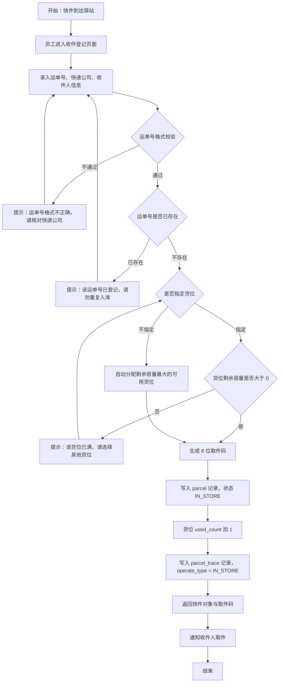
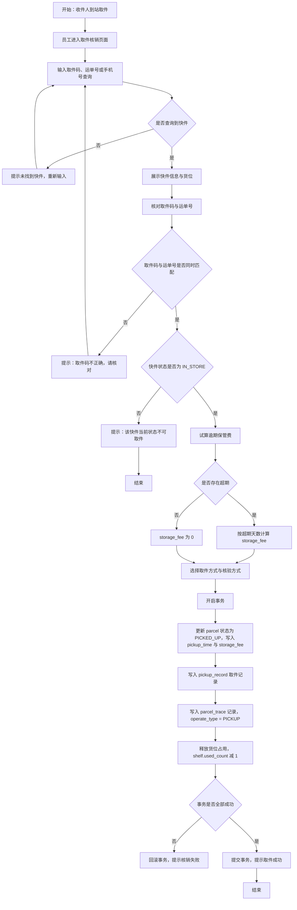
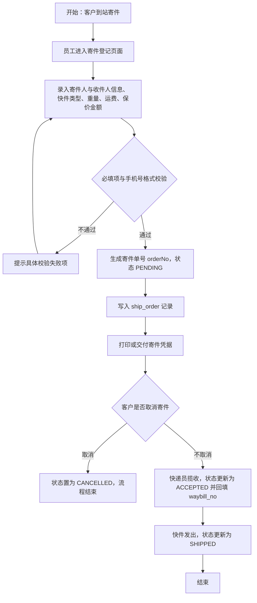
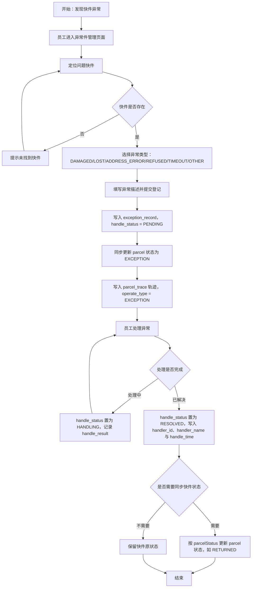

# 面向快递驿站的快件收发管理系统 软件需求规格说明书

| 项目名称 | 面向快递驿站的快件收发管理系统 |
| -------- | ------------------------------ |
| 文档名称 | 软件需求规格说明书（SRS） |
| 作者 | 吴宇航 |
| 版本 | V1.0 |
| 技术栈 | Java 17、Spring Boot 3.2.5、MyBatis-Plus 3.5.7、MySQL 8.0、Vue 3、Vite、Element Plus、JWT |
| 部署形态 | 前后端分离，前端 5173 端口，后端 8080 端口，接口统一前缀 `/api` |

---

## 1 引言

### 1.1 编写目的

本文档面向快递驿站快件收发管理系统的设计、开发、测试与验收全过程，用于明确系统的功能边界、角色权限、业务流程、功能需求与非功能需求，作为后续概要设计、详细设计、数据库设计、编码实现与系统测试的唯一需求依据。

本文档的预期读者包括：毕业设计指导教师与评审教师、系统开发者本人、参与功能测试与验收的人员，以及后续在此基础上进行功能扩展的维护人员。

### 1.2 项目背景

随着电子商务与社区团购的持续发展，快递末端投递量迅速增长，快递驿站已成为住宅小区、高校校园等场景下快件集中收发的主要节点。传统驿站作业普遍存在以下问题：

1. **登记手段落后**：快件到站后依靠纸质台账或手工表格登记运单号、收件人信息，记录易遗漏、易涂改，事后难以追溯。
2. **取件核验依赖人工**：取件时凭收件人报出的姓名或手机号查找，缺乏唯一性凭据，容易出现错领、冒领。
3. **货位管理粗放**：快件堆放位置无记录，找件耗时长，货位占用情况无法量化。
4. **逾期与异常件缺乏管理**：超期未取快件的保管费计算无依据，破损、丢失、拒收等异常件没有留痕与处理闭环。
5. **数据无法沉淀**：驿站业务量、快递公司分布、出入库趋势等经营数据无法统计，难以支撑经营决策。

针对上述问题，本课题设计并实现一套面向快递驿站的快件收发管理系统。系统采用 Java 17 + Spring Boot 3.2.5 + MyBatis-Plus 3.5.7 + MySQL 8.0 构建后端服务，采用 Vue 3 + Vite + Element Plus 构建前端单页应用，通过 JWT 实现无状态认证，通过 RBAC 模型实现菜单级与按钮级的细粒度权限控制，覆盖快件入库、取件核销、派送、寄件受理、异常件处理、统计分析与基础数据维护等驿站日常作业环节。

### 1.3 术语定义

| 术语 | 英文 / 标识 | 定义 |
| ---- | ----------- | ---- |
| 驿站 | station | 承担快件末端揽收、暂存与交付职能的网点。系统中以 `station` 表存储，包含驿站编号 `station_code`、名称 `station_name`、地址 `address`、联系电话 `contact_phone`、负责人 `manager_name`、营业时间 `business_hours`、货位总容量 `capacity` 与状态 `status`。 |
| 运单号 | waybill_no | 快递公司赋予每一票快件的全局唯一业务标识，如 `SF1234567890123`。系统中存储于 `parcel.waybill_no`，由唯一索引 `uk_parcel_waybill` 保证不重复。 |
| 取件码 | pickup_code | 快件入库时由系统生成的 8 位数字凭据，用于取件环节与运单号共同核验，保证"凭码取件"的唯一性。存储于 `parcel.pickup_code`，索引为 `idx_parcel_pickup_code`。 |
| 在库 | IN_STORE | 快件已由员工登记入库、正存放于驿站指定货位、等待收件人取件的状态。该状态下快件占用货位容量。 |
| 核销 | pickup / verify | 收件人或代取人到达驿站后，员工核验取件码与运单号，将快件交付并完成出库登记的业务动作。核销结果记录于 `pickup_record` 表，快件状态更新为 `PICKED_UP`。 |
| 异常件 | exception record | 在入库、保管或派送过程中出现破损、丢失、地址错误、拒收、长期未取等异常情况的快件。系统在 `exception_record` 表中登记异常类型 `exception_type`、描述 `description` 与处理状态 `handle_status`，并将快件状态置为 `EXCEPTION`。 |
| 货位 | shelf | 驿站内用于存放快件的货架库位，编号形如 `A-01-01`。系统以 `shelf` 表记录其所属驿站 `station_id`、库区 `area`、库位容量 `capacity` 与已使用数量 `used_count`。 |
| 逻辑删除 | deleted | 数据不进行物理删除，仅将 `deleted` 字段置为 1 的记录淘汰方式，用于保留历史业务数据与操作追溯能力。 |
| 代取 | AGENT | 取件方式之一，指非收件人本人凭取件码或手机号代为领取快件，对应 `pickup_record.pickup_type = 'AGENT'`。 |
| 派送 | DELIVERING | 应客户要求由驿站员工送货上门的状态，快件由 `IN_STORE` 变更为 `DELIVERING`，送达签收后变更为 `PICKED_UP`。 |
| 逾期保管费 | storage_fee | 快件在库天数超过免费保管天数 `overdue_days` 后按规则计算的保管费用，记录于 `parcel.storage_fee` 与 `pickup_record.storage_fee`。 |

### 1.4 参考资料

1. `sql/01_schema.sql`：数据库结构脚本，含 12 张表的字段、注释与索引定义。
2. `sql/02_data.sql`：初始化数据脚本，含角色、权限、用户、驿站、货位与示范业务数据。
3. `docs/api-contract.md`：前后端接口契约，含统一响应体、枚举定义、接口清单与页面权限对照表。

---

## 2 项目范围与目标

### 2.1 项目范围

本系统面向单驿站与多驿站混合运营场景，服务对象为快递驿站的管理员、员工与收件人。系统范围包含以下十个功能域：

| 序号 | 功能域 | 说明 |
| ---- | ------ | ---- |
| 1 | 认证与账号 | 登录、注册、退出登录、当前用户信息、当前用户菜单树 |
| 2 | 用户与权限管理 | 用户增删改查、启用禁用、重置密码、角色维护、角色权限分配 |
| 3 | 收件登记 | 快件入库登记、运单号校验、取件码生成、货位指定与自动分配 |
| 4 | 取件核销 | 按取件码/运单号/手机号定位快件、核销出库、逾期费收取、代取与送货上门登记 |
| 5 | 派送管理 | 在库快件转派送状态、派送轨迹留痕 |
| 6 | 寄件登记 | 寄件单登记、寄件单编辑、状态流转与运单号回填、寄件单取消 |
| 7 | 异常件管理 | 异常件登记、异常处理、快件状态同步 |
| 8 | 快件查询与轨迹 | 组合条件分页查询、模糊查询、详情查看、轨迹查看 |
| 9 | 数据统计与导出 | 概览指标、出入库趋势、快递公司分布、快件类型分布、驿站业务量排行、台账导出 Excel |
| 10 | 基础数据管理 | 驿站管理、货位管理 |

### 2.2 建设目标

1. **业务数字化**：将快件入库、取件、派送、寄件、异常处理的全过程由纸质台账迁移至系统，实现全流程可查询、可追溯。
2. **核验唯一化**：以 8 位取件码与运单号双重匹配作为取件凭据，配合快件状态校验，杜绝重复核销与错领。
3. **货位可视化**：为每票在库快件记录存放库位，实时维护 `shelf.used_count`，支持自动分配剩余容量最大的可用货位。
4. **管理规范化**：异常件从登记到处理形成闭环，逾期保管费按超期天数自动试算并留痕。
5. **数据可分析**：提供当日入库量、当日取件量、当日寄件量、在库量、逾期量、异常量、派送中数量、货位使用率等指标与多维度统计图表。
6. **权限可控化**：基于 RBAC 模型实现三类角色的菜单级与按钮级权限隔离，普通用户仅能查询本人名下快件。

### 2.3 约束与不在本期范围

1. 系统采用前后端分离架构，后端仅提供 RESTful 风格的 JSON 接口，统一前缀为 `/api`，统一响应体为 `{ code, message, data }`。
2. 认证采用 JWT，令牌有效期 `expiresIn` 为 86400 秒，前端存储于 localStorage 的 `es_token`，请求头格式为 `Authorization: Bearer <token>`。
3. 数据库统一使用 MySQL 8.0，字符集为 `utf8mb4`，排序规则为 `utf8mb4_general_ci`，存储引擎为 InnoDB，库名为 `express_station`。
4. 本期不涉及与快递公司开放平台的运单数据对接，运单号由员工在收件登记或寄件状态流转时录入；本期不涉及短信平台对接、硬件扫码枪对接、移动端 App 与在线支付。
5. 系统不承担快递面单打印与运费定价职能，`freight`、`insured_value` 等金额字段由员工录入。

---

## 3 用户角色与权限分析

### 3.1 角色模型

系统采用 RBAC（基于角色的访问控制）模型，表结构由 `sys_user`、`sys_role`、`sys_user_role`、`sys_permission`、`sys_role_permission` 五张表构成。用户与角色为多对多关系，角色与权限为多对多关系。权限记录通过 `perm_type` 区分类型：`MENU` 表示菜单（含 `path` 路由地址与 `icon` 图标），`BUTTON` 表示按钮级操作权限。角色编码固定为三类：

| role_code | role_name | 说明 |
| --------- | --------- | ---- |
| ADMIN | 系统管理员 | 拥有系统全部权限，负责用户、角色、驿站等基础数据维护 |
| STAFF | 驿站员工 | 负责快件入库登记、取件核销、寄件受理、异常件处理等日常业务 |
| USER | 普通用户 | 收件人，可查询本人名下快件的在库与取件状态 |

### 3.2 系统管理员（ADMIN）

ADMIN 的职责是保障系统可用与基础数据准确：维护用户账号及其角色归属，维护角色与权限的对应关系，维护驿站与货架库位等基础数据。ADMIN 同时具备 STAFF 的全部业务操作能力，可处理任何驿站的业务数据。初始账号为 `admin`，真实姓名"吴宇航"，`station_id` 为空，表示不限定归属驿站。

### 3.3 驿站员工（STAFF）

STAFF 是系统的主要使用者，其操作范围限定于所属驿站。依据 `02_data.sql` 的权限分配，STAFF 拥有除"系统管理"外的全部业务权限，具体包括：首页概览、快件查询、收件登记、取件核销、派送操作、编辑快件、导出台账、查看轨迹、寄件查询、寄件登记、编辑寄件单、更新寄件状态、异常件查询、异常件登记、异常件处理、查看统计、个人中心。STAFF 不具备删除快件（`parcel:delete`）、删除寄件单（`ship:delete`）与系统管理相关权限。初始账号为 `staff01`（驿站 1）与 `staff02`（驿站 2）。

### 3.4 普通用户（USER）

USER 即收件人，通过注册或由 ADMIN 创建，默认分配 `USER` 角色。USER 可访问首页概览、快件查询与个人中心三个菜单，对应权限标识为 `dashboard`、`parcel:list`、`profile`。在调用 `/api/parcels/page` 接口时，后端强制附加过滤条件，仅返回 `receiver_phone` 等于当前用户 `phone` 的快件，从而实现数据层面的越权隔离。USER 不可访问收件登记、取件核销、寄件管理、异常件管理、数据统计与系统管理功能。

### 3.5 权限矩阵

下表列出各功能模块与三类角色的访问关系，"√"表示允许，"×"表示拒绝。权限标识取自 `sys_permission.perm_code`。

| 功能模块 | 页面路由 | 权限标识 | ADMIN | STAFF | USER |
| -------- | -------- | -------- | :---: | :---: | :--: |
| 登录 / 注册 | `/login`、`/register` | — | √ | √ | √ |
| 首页概览 | `/dashboard` | `dashboard` | √ | √ | √ |
| 快件查询 | `/parcel/list` | `parcel:list` | √ | √ | √（仅本人） |
| 收件登记 | `/parcel/in` | `parcel:in` | √ | √ | × |
| 取件核销 | `/parcel/pickup` | `parcel:pickup` | √ | √ | × |
| 派送操作 | — | `parcel:deliver` | √ | √ | × |
| 编辑快件 | — | `parcel:edit` | √ | √ | × |
| 删除快件 | — | `parcel:delete` | √ | × | × |
| 导出台账 | — | `parcel:export` | √ | √ | × |
| 查看轨迹 | — | `parcel:trace` | √ | √ | × |
| 寄件查询 | `/ship/list` | `ship:list` | √ | √ | × |
| 寄件登记 | — | `ship:add` | √ | √ | × |
| 编辑寄件单 | — | `ship:edit` | √ | √ | × |
| 删除寄件单 | — | `ship:delete` | √ | × | × |
| 更新寄件状态 | — | `ship:status` | √ | √ | × |
| 异常件查询 | `/exception/list` | `exception:list` | √ | √ | × |
| 异常件登记 | — | `exception:add` | √ | √ | × |
| 异常件处理 | — | `exception:handle` | √ | √ | × |
| 查看统计 | `/stats` | `stats:view` | √ | √ | × |
| 用户管理 | `/system/user` | `system:user:list` | √ | × | × |
| 新增用户 | — | `system:user:add` | √ | × | × |
| 编辑用户 | — | `system:user:edit` | √ | × | × |
| 删除用户 | — | `system:user:delete` | √ | × | × |
| 重置密码 | — | `system:user:reset` | √ | × | × |
| 角色权限 | `/system/role` | `system:role:list` | √ | × | × |
| 分配权限 | — | `system:role:assign` | √ | × | × |
| 驿站管理 | `/system/station` | `system:station:list` | √ | × | × |
| 编辑驿站 | — | `system:station:edit` | √ | × | × |
| 货位管理 | `/system/shelf` | `system:shelf:list` | √ | × | × |
| 编辑货位 | — | `system:shelf:edit` | √ | × | × |
| 个人中心 | `/profile` | `profile` | √ | √ | √ |

权限校验规则：后端在受保护接口上校验当前令牌所携带的权限集合，校验不通过返回 `code = 403`、`message = 无操作权限，请联系管理员`；未携带令牌或令牌失效返回 `code = 401`、`message = 登录已过期，请重新登录`。前端依据登录后返回的 `permissions` 数组渲染菜单，并通过 `v-perm="'parcel:export'"` 指令或 `hasPerm('parcel:export')` 方法控制按钮显示。

---

## 4 业务流程分析

### 4.1 快件入库流程

流程说明：收件登记是全部业务的数据源头。员工录入 `waybillNo`、`stationId`、`expressCompany`、`parcelType`、`receiverName`、`receiverPhone`、`weight`、`freight`、`shelfId`、`overdueDays`、`remark` 等字段后，后端首先按照快递公司对应的正则规则校验运单号格式，再检查 `parcel.waybill_no` 是否重复。校验通过后生成 8 位数字取件码并计算 `in_time`。若请求未携带 `shelfId`，则从当前驿站 `status = 1` 且剩余容量大于 0 的货位中选取剩余容量最大者；若全部货位已满，则提示员工新增或调整货位。登记成功后返回完整快件对象，其中包含系统生成的 `pickupCode`，员工可据此通知收件人。

### 4.2 取件核销流程

流程说明：取件核销要求 `waybillNo` 与 `pickupCode` 同时匹配，任一项不符即返回 `code = 1001`、`message = 取件码不正确，请核对`。匹配成功后校验 `parcel.status` 必须为 `IN_STORE`，已取件、派送中、异常、已退回的快件均返回 `code = 1001`、`message = 该快件当前状态不可取件`。后端在同一事务内完成四项操作：更新 `parcel` 的状态、取件时间与实收保管费；插入 `pickup_record` 记录，包含 `pickup_code`、`receiver_name`、`receiver_phone`、`pickup_type`、`verify_type`、`storage_fee`、`operator_id`、`operator_name` 与 `pickup_time`；插入 `parcel_trace` 轨迹，`operate_type` 为 `PICKUP`；将对应 `shelf.used_count` 减 1。任一步骤失败则整体回滚，防止出现"状态已改但记录未写"或"记录已写但货位未释放"的不一致。

### 4.3 寄件受理流程

流程说明：寄件登记由员工在 `/api/ship-orders` 接口提交，后端自动生成 `orderNo`（规则为字符 `S` + `yyyyMMddHHmmss` + 2 位随机数），初始状态为 `PENDING`（待揽收），并将当前登录员工写入 `operator_id`。寄件单仅在 `PENDING` 状态下允许通过 `PUT /api/ship-orders/{id}` 修改；状态流转通过 `PUT /api/ship-orders/{id}/status` 完成，从 `PENDING` 流转到 `ACCEPTED` 时需回填 `waybillNo`。若客户取消寄件，则状态置为 `CANCELLED`，该单据不再参与后续流转。所有状态变更均记录 `update_time`，删除操作采用逻辑删除。

### 4.4 异常件处理流程

流程说明：异常件登记通过 `POST /api/exceptions` 提交，请求体包含 `parcelId`、`exceptionType` 与 `description`。登记成功后系统在 `exception_record` 中插入一条 `handle_status = 'PENDING'` 的记录，同时把对应快件状态置为 `EXCEPTION` 并写入 `operate_type = 'EXCEPTION'` 的轨迹，保证异常发生时间与快件状态变更时间一致。异常处理通过 `PUT /api/exceptions/{id}/handle` 完成，请求体包含 `handleStatus`、`handleResult` 与可选的 `parcelStatus`。当 `handleStatus` 置为 `RESOLVED` 时，系统写入处理人 `handler_id`、`handler_name` 与 `handle_time`；若同时传入 `parcelStatus`，则同步更新快件状态，例如破损拒收场景将快件状态更新为 `RETURNED`。

---

## 5 功能需求

功能需求按模块编号，编号格式为 `FR-XX`。优先级分为三级：高（必须实现，缺失则业务不可闭环）、中（应当实现，影响使用效率）、低（可选实现，属增强功能）。

### 5.1 认证与账号模块

| 项目 | 内容 |
| ---- | ---- |
| 需求编号 | FR-01 |
| 需求名称 | 用户登录 |
| 需求描述 | 用户凭用户名与密码登录系统，登录成功后获得 JWT 令牌与个人权限集合。 |
| 输入 | `POST /api/auth/login`，请求体 `{ username, password }`。 |
| 处理 | 依据 `sys_user.username` 查询用户（过滤 `deleted = 0`）；校验 `status` 是否为 1；使用 BCrypt 比对 `password`；查询用户角色与角色对应的权限集合；更新 `last_login_time`；签发 JWT 令牌。 |
| 输出 | `code = 200`，`data` 含 `token`、`tokenType`（Bearer）、`expiresIn`（86400）与 `userInfo`（`id`、`username`、`realName`、`phone`、`avatar`、`stationId`、`stationName`、`roles`、`permissions`）。失败时 `code = 1001`，提示"用户名或密码错误"或"账号已被禁用，请联系管理员"。 |
| 优先级 | 高 |

| 项目 | 内容 |
| ---- | ---- |
| 需求编号 | FR-02 |
| 需求名称 | 用户注册 |
| 需求描述 | 未登录访客自助注册为普通用户，注册后默认分配 `USER` 角色。 |
| 输入 | `POST /api/auth/register`，请求体 `{ username, password, confirmPassword, realName, phone }`。 |
| 处理 | 校验 `username` 是否已存在；校验 `password` 长度为 6～20 位且与 `confirmPassword` 一致；校验 `phone` 为 11 位手机号；使用 BCrypt 加密密码；写入 `sys_user`，`status = 1`、`gender = 0`；写入 `sys_user_role` 关联 `USER` 角色。 |
| 输出 | `code = 200`，`data` 为新用户标识；用户名重复时 `code = 1001`、提示"该用户名已被注册"。 |
| 优先级 | 高 |

| 项目 | 内容 |
| ---- | ---- |
| 需求编号 | FR-03 |
| 需求名称 | 登录状态维护 |
| 需求描述 | 支持退出登录、获取当前登录用户信息与当前用户菜单树。 |
| 输入 | `POST /api/auth/logout`；`GET /api/auth/me`；`GET /api/auth/menus`，均需携带 `Authorization: Bearer <token>`。 |
| 处理 | `/auth/me` 依据令牌中的用户标识查询用户、角色、所属驿站名称与权限集合；`/auth/menus` 将 `perm_type = 'MENU'` 且 `status = 1` 的权限按 `parent_id` 组装为树形结构；`/auth/logout` 由前端清除 localStorage 中的 `es_token`。 |
| 输出 | `/auth/me` 返回与登录一致的 `userInfo`；`/auth/menus` 返回含 `id`、`permCode`、`permName`、`path`、`icon`、`children` 的菜单树；令牌失效时 `code = 401`、提示"登录已过期，请重新登录"。 |
| 优先级 | 高 |

### 5.2 用户与权限管理模块

| 项目 | 内容 |
| ---- | ---- |
| 需求编号 | FR-04 |
| 需求名称 | 用户管理 |
| 需求描述 | 管理员对系统用户进行分页查询、新增、编辑、逻辑删除、启用禁用与重置密码。 |
| 输入 | `GET /api/users/page?pageNum&pageSize&username&realName&phone&status&roleCode&stationId`；`POST /api/users`（可指定 `roleIds`、`stationId`）；`PUT /api/users/{id}`；`DELETE /api/users/{id}`；`PUT /api/users/{id}/status?status=0`；`PUT /api/users/{id}/password?password=123456`。 |
| 处理 | 分页查询按条件动态拼接；新增时校验用户名唯一并对密码进行 BCrypt 加密，同时写入角色关联；编辑时更新基本信息并按需重置角色关联；删除为逻辑删除（`deleted = 1`）；启用禁用更新 `status`；重置密码写入加密后的新密码。 |
| 输出 | 分页响应的 `data` 含 `total`、`pages`、`pageNum`、`pageSize`、`list`，记录含 `id`、`username`、`realName`、`phone`、`gender`、`avatar`、`stationId`、`stationName`、`status`、`roleIds`、`roleNames`、`lastLoginTime`、`createTime`。无权限时 `code = 403`。 |
| 优先级 | 高 |

| 项目 | 内容 |
| ---- | ---- |
| 需求编号 | FR-05 |
| 需求名称 | 角色管理与权限分配 |
| 需求描述 | 管理员维护角色基本信息，查看并重新分配角色权限。 |
| 输入 | `GET /api/roles/list`；`GET /api/roles/page`；`POST /api/roles`；`PUT /api/roles/{id}`；`DELETE /api/roles/{id}`；`GET /api/roles/{id}/permissions`；`PUT /api/roles/{id}/permissions`，请求体 `{ "permIds": [1, 10, 11] }`；`GET /api/permissions/tree?type=MENU\|ALL`。 |
| 处理 | 角色字段包含 `role_code`、`role_name`、`description`、`sort`、`status`；权限分配采用"先清空后写入"策略更新 `sys_role_permission`；权限树按 `parent_id` 递归组装，`type = MENU` 时仅返回菜单权限。 |
| 输出 | 角色列表、角色已有权限 `id` 数组、含 `permCode`、`permName`、`permType`、`children` 的权限树；分配成功后需重新登录或刷新权限缓存以生效。 |
| 优先级 | 中 |

| 项目 | 内容 |
| ---- | ---- |
| 需求编号 | FR-06 |
| 需求名称 | 个人中心 |
| 需求描述 | 任意登录用户可查看与修改本人资料、修改本人登录密码。 |
| 输入 | `PUT /api/users/profile`；`PUT /api/users/self/password`，请求体 `{ oldPassword, newPassword }`。 |
| 处理 | 修改资料时仅允许更新 `real_name`、`phone`、`gender`、`avatar` 字段；修改密码时先以 BCrypt 比对 `oldPassword`，通过后写入新密码。 |
| 输出 | 修改成功返回 `code = 200`、`message = 操作成功`；原密码错误返回 `code = 1001` 并给出中文提示。 |
| 优先级 | 中 |

### 5.3 收件登记模块

| 项目 | 内容 |
| ---- | ---- |
| 需求编号 | FR-07 |
| 需求名称 | 快件入库登记 |
| 需求描述 | 员工将到达驿站的快件登记入库，系统生成取件码并记录存放货位。 |
| 输入 | `POST /api/parcels/in-store`，请求体含 `waybillNo`、`stationId`、`expressCompany`、`parcelType`、`receiverName`、`receiverPhone`、`weight`、`freight`、`shelfId`（可选）、`overdueDays`、`remark`。 |
| 处理 | 按快递公司正则校验 `waybillNo`；校验 `waybillNo` 唯一性；校验 `receiverPhone` 为 11 位手机号；生成 8 位数字 `pickupCode`；设置 `in_time` 为当前时间、`status = 'IN_STORE'`、`overdue_days` 默认 3、`storage_fee` 默认 0.00、`operator_id` 为当前登录员工；写入 `parcel`；`shelf.used_count` 加 1；写入 `parcel_trace`，`operate_type = 'IN_STORE'`。 |
| 输出 | `code = 200`，`data` 为新建快件对象（含 `pickupCode`）。异常情形：运单号格式错误返回 `1001` 并提示"运单号格式不正确，请核对快递公司"；运单号重复返回 `1001` 并提示"该运单号已登记，请勿重复入库"；货位已满返回 `1001` 并提示"该货位已满，请选择其他货位"。 |
| 优先级 | 高 |

| 项目 | 内容 |
| ---- | ---- |
| 需求编号 | FR-08 |
| 需求名称 | 货位自动分配 |
| 需求描述 | 收件登记未指定货位时，系统自动分配当前驿站剩余容量最大的可用货位。 |
| 输入 | `POST /api/parcels/in-store` 且 `shelfId` 为空或未传。 |
| 处理 | 查询 `shelf` 表中 `station_id` 等于目标驿站、`status = 1` 且 `capacity - used_count > 0` 的记录，按剩余容量降序取第一条作为存放货位；若无满足条件的货位，则登记失败。 |
| 输出 | 返回的快件对象中 `shelfId`、`shelfCode` 为系统分配的货位；无可用货位时返回 `code = 1001` 并提示货位不足，需管理员新增货位。 |
| 优先级 | 中 |

### 5.4 快件查询与轨迹模块

| 项目 | 内容 |
| ---- | ---- |
| 需求编号 | FR-09 |
| 需求名称 | 快件快速定位 |
| 需求描述 | 取件核销场景下，按取件码、运单号或手机号快速定位快件。 |
| 输入 | `GET /api/parcels/query?keyword={取件码或运单号或手机号}&stationId=1`。 |
| 处理 | 对 `keyword` 依次匹配 `pickup_code`、`waybill_no`、`receiver_phone`，限定 `deleted = 0`，限定驿站时按 `station_id` 过滤，结果按入库时间倒序截取前 20 条。 |
| 输出 | `data` 为快件对象数组，字段与快件对象一致；无匹配时返回空数组。 |
| 优先级 | 高 |

| 项目 | 内容 |
| ---- | ---- |
| 需求编号 | FR-10 |
| 需求名称 | 快件分页条件查询 |
| 需求描述 | 按运单号、取件码、收件人姓名、收件人手机号、快递公司、状态、快件类型、驿站与时间区间组合查询快件。 |
| 输入 | `GET /api/parcels/page?pageNum=1&pageSize=10&waybillNo=&pickupCode=&receiverName=&receiverPhone=&expressCompany=&status=&parcelType=&stationId=&startTime=&endTime=`，全部参数可选。 |
| 处理 | 动态拼接查询条件；运单号、取件码支持精确匹配，收件人姓名支持模糊匹配；`startTime`、`endTime` 作用于 `in_time` 区间；`USER` 角色调用时后端强制附加 `receiver_phone` 等于当前用户手机号的条件。 |
| 输出 | 分页响应，`list` 中每项为快件对象，含 `stationName`、`shelfCode`、`parcelTypeName`、`statusName`、`storageDays`、`overdueFee` 等派生字段。 |
| 优先级 | 高 |

| 项目 | 内容 |
| ---- | ---- |
| 需求编号 | FR-11 |
| 需求名称 | 快件详情与轨迹查看 |
| 需求描述 | 查看单个快件的完整信息与全部操作轨迹。 |
| 输入 | `GET /api/parcels/{id}`；`GET /api/parcels/{id}/traces`。 |
| 处理 | 依据主键查询 `parcel` 及关联的驿站名称、货位编号、入库操作员姓名；查询 `parcel_trace` 中 `parcel_id` 等于目标快件的记录并按 `operate_time` 排序。 |
| 输出 | 详情返回快件对象；轨迹返回数组，每项含 `id`、`operateType`、`operateDesc`、`operatorName`、`operateTime`。无对应记录时返回 `code = 404`。 |
| 优先级 | 中 |

| 项目 | 内容 |
| ---- | ---- |
| 需求编号 | FR-12 |
| 需求名称 | 快件信息编辑与删除 |
| 需求描述 | 员工在授权范围内修改快件信息，管理员删除误登记的快件。 |
| 输入 | `PUT /api/parcels/{id}`，可改 `receiverName`、`receiverPhone`、`parcelType`、`shelfId`、`overdueDays`、`remark`；`DELETE /api/parcels/{id}`。 |
| 处理 | 编辑操作校验权限 `parcel:edit`，变更货位时同步调整原货位与新货位的 `used_count`；删除操作校验权限 `parcel:delete`，执行逻辑删除（`deleted = 1`）并释放货位占用。 |
| 输出 | 成功返回 `code = 200`；无权限返回 `code = 403`、提示"无操作权限，请联系管理员"。 |
| 优先级 | 中 |

### 5.5 取件核销模块

| 项目 | 内容 |
| ---- | ---- |
| 需求编号 | FR-13 |
| 需求名称 | 取件核销出库 |
| 需求描述 | 员工核验取件凭据后将快件交付收件人，完成出库登记。 |
| 输入 | `POST /api/parcels/pickup`，请求体含 `waybillNo`、`pickupCode`、`receiverName`、`receiverPhone`、`pickupType`、`verifyType`、`storageFee`、`remark`。 |
| 处理 | 校验 `waybillNo` 与 `pickupCode` 同时匹配；校验 `parcel.status = 'IN_STORE'`；在单事务内更新 `parcel` 的 `status = 'PICKED_UP'`、`pickup_time`、`storage_fee`；写入 `pickup_record`；写入 `parcel_trace`（`operate_type = 'PICKUP'`）；`shelf.used_count` 减 1。 |
| 输出 | 成功返回 `code = 200`；取件码不匹配返回 `1001`、提示"取件码不正确，请核对"；状态不允许返回 `1001`、提示"该快件当前状态不可取件"。 |
| 优先级 | 高 |

| 项目 | 内容 |
| ---- | ---- |
| 需求编号 | FR-14 |
| 需求名称 | 逾期保管费试算与收取 |
| 需求描述 | 核销前试算快件逾期保管费，核销时按实际金额写入记录。 |
| 输入 | `GET /api/parcels/{id}/overdue-fee`；核销请求中的 `storageFee`。 |
| 处理 | 依据 `parcel.in_time` 与当前时间计算在库天数 `storageDays`；与 `overdue_days` 比较得出超期天数；按既定单价计算 `overdueFee` 并返回三元组；核销时将实际收取金额写入 `parcel.storage_fee` 与 `pickup_record.storage_fee`。 |
| 输出 | `data` 为 `{ "storageDays": 5, "overdueDays": 3, "overdueFee": 4.00 }`；未超期时 `overdueFee = 0`。 |
| 优先级 | 中 |

| 项目 | 内容 |
| ---- | ---- |
| 需求编号 | FR-15 |
| 需求名称 | 代取与送货上门登记 |
| 需求描述 | 支持非本人取件与送货上门两种交付方式，并记录核验方式。 |
| 输入 | `POST /api/parcels/pickup`，`pickupType` 取 `SELF`、`AGENT`、`DELIVERY`；`verifyType` 取 `CODE`、`ID_CARD`、`PHONE`。 |
| 处理 | 按传入枚举写入 `pickup_record.pickup_type` 与 `pickup_record.verify_type`；代取时 `receiver_name`、`receiver_phone` 记录实际取件人信息，原收件人信息保留于 `parcel` 表。 |
| 输出 | 取件记录中体现实际取件人与核验方式，例如 `pickup_type = 'AGENT'`、`verify_type = 'PHONE'`。 |
| 优先级 | 中 |

### 5.6 派送模块

| 项目 | 内容 |
| ---- | ---- |
| 需求编号 | FR-16 |
| 需求名称 | 派送操作 |
| 需求描述 | 应客户要求将快件由在库状态转为派送中状态，并记录派送轨迹。 |
| 输入 | `PUT /api/parcels/{id}/deliver`。 |
| 处理 | 校验权限 `parcel:deliver`；校验快件当前状态为 `IN_STORE`；更新 `parcel.status = 'DELIVERING'`；写入 `parcel_trace`，`operate_type = 'DELIVER'`；派送中快件仍占用货位容量。 |
| 输出 | 成功返回 `code = 200`；状态不满足时返回 `1001` 并给出中文提示。派送完成后由核销环节将状态更新为 `PICKED_UP` 并释放货位。 |
| 优先级 | 中 |

### 5.7 寄件登记模块

| 项目 | 内容 |
| ---- | ---- |
| 需求编号 | FR-17 |
| 需求名称 | 寄件单登记 |
| 需求描述 | 员工受理客户寄件请求，登记寄件人与收件人信息并生成寄件单。 |
| 输入 | `POST /api/ship-orders`，请求体含 `stationId`、`expressCompany`、`senderName`、`senderPhone`、`senderAddress`、`receiverName`、`receiverPhone`、`receiverAddress`、`parcelType`、`weight`、`freight`、`insuredValue`。 |
| 处理 | 校验手机号格式与必填字段；生成 `orderNo`（`S` + `yyyyMMddHHmmss` + 2 位随机数）；设置 `status = 'PENDING'`、`operator_id` 为当前员工、`create_time` 为当前时间；写入 `ship_order`。 |
| 输出 | `code = 200`，`data` 为寄件单对象，含 `orderNo`、`status`、`statusName = '待揽收'`、`parcelTypeName`。 |
| 优先级 | 高 |

| 项目 | 内容 |
| ---- | ---- |
| 需求编号 | FR-18 |
| 需求名称 | 寄件单查询、编辑与状态流转 |
| 需求描述 | 查询寄件单，在待揽收状态下编辑，按业务进度更新状态并回填运单号，必要时取消或删除寄件单。 |
| 输入 | `GET /api/ship-orders/page?pageNum&pageSize&orderNo&senderName&senderPhone&receiverName&receiverPhone&status&stationId&startTime&endTime`；`GET /api/ship-orders/{id}`；`PUT /api/ship-orders/{id}`；`PUT /api/ship-orders/{id}/status?status=ACCEPTED&waybillNo=SF123`；`DELETE /api/ship-orders/{id}`。 |
| 处理 | 分页查询按条件动态拼接并限定 `deleted = 0`；编辑仅允许 `PENDING` 状态；状态流转在 `PENDING`、`ACCEPTED`、`SHIPPED`、`CANCELLED` 之间按业务顺序变更，流转至 `ACCEPTED` 时可回填 `waybill_no`；删除为逻辑删除。 |
| 输出 | 分页结果含 `orderNo`、`stationName`、`senderName`、`receiverName`、`status`、`statusName`、`waybillNo`、`operatorName`、`createTime`；非 `PENDING` 状态编辑返回 `1001` 并提示不可修改。 |
| 优先级 | 中 |

### 5.8 异常件管理模块

| 项目 | 内容 |
| ---- | ---- |
| 需求编号 | FR-19 |
| 需求名称 | 异常件登记 |
| 需求描述 | 登记快件异常情况，并将快件状态同步为异常件。 |
| 输入 | `POST /api/exceptions`，请求体 `{ parcelId, exceptionType, description }`；`exceptionType` 取 `DAMAGED`、`LOST`、`ADDRESS_ERROR`、`REFUSED`、`TIMEOUT`、`OTHER`。 |
| 处理 | 校验快件存在；写入 `exception_record`，`handle_status = 'PENDING'`、`station_id` 取自快件所属驿站；更新 `parcel.status = 'EXCEPTION'`；写入 `parcel_trace`，`operate_type = 'EXCEPTION'`。 |
| 输出 | `code = 200`，`data` 为异常记录对象，含 `exceptionTypeName`、`handleStatusName` 等中文字段；快件不存在时返回 `404`。 |
| 优先级 | 高 |

| 项目 | 内容 |
| ---- | ---- |
| 需求编号 | FR-20 |
| 需求名称 | 异常件查询与处理 |
| 需求描述 | 按条件查询异常记录，登记处理进展与处理结果，必要时同步快件状态。 |
| 输入 | `GET /api/exceptions/page?pageNum&pageSize&waybillNo&exceptionType&handleStatus&stationId`；`PUT /api/exceptions/{id}/handle`，请求体 `{ handleStatus, handleResult, parcelStatus }`。 |
| 处理 | 分页查询按条件动态拼接；处理时更新 `handle_status` 与 `handle_result`，置为 `RESOLVED` 时写入 `handler_id`、`handler_name` 与 `handle_time`；当传入 `parcelStatus` 时同步更新快件状态（如 `RETURNED`）。 |
| 输出 | 处理成功返回 `code = 200`；记录对象含 `handlerName`、`handleResult`、`stationName`、`createTime`、`handleTime`。 |
| 优先级 | 高 |

### 5.9 数据统计与导出模块

| 项目 | 内容 |
| ---- | ---- |
| 需求编号 | FR-21 |
| 需求名称 | 业务概览统计 |
| 需求描述 | 在首页概览展示当日与全局关键指标。 |
| 输入 | `GET /api/stats/overview?stationId=`。 |
| 处理 | 统计当日入库量、当日取件量、当日寄件量、在库量、逾期量、异常量、派送中数量、快件总数，并汇总驿站货位总容量与实际占用数量计算使用率。 |
| 输出 | `data` 含 `todayInCount`、`todayPickupCount`、`todayShipCount`、`inStoreCount`、`overdueCount`、`exceptionCount`、`deliveringCount`、`totalParcelCount` 与 `shelfUsage`（`total`、`used`、`rate`）。 |
| 优先级 | 中 |

| 项目 | 内容 |
| ---- | ---- |
| 需求编号 | FR-22 |
| 需求名称 | 多维度统计分析 |
| 需求描述 | 提供出入库趋势、快递公司分布、快件类型分布与驿站业务量排行四类统计。 |
| 输入 | `GET /api/stats/trend?days=7&stationId=`；`GET /api/stats/company?stationId=`；`GET /api/stats/parcel-type?stationId=`；`GET /api/stats/station-rank`（仅 ADMIN）。 |
| 处理 | 趋势统计按日聚合 `parcel.in_time` 与 `parcel.pickup_time`；公司分布与类型分布按 `express_company`、`parcel_type` 分组计数并映射中文名称；驿站排行按驿站聚合快件数与取件数。 |
| 输出 | 趋势返回 `dates`、`inCounts`、`pickupCounts` 三个并行数组；分布返回 `[{ name, value }]`；排行返回 `[{ stationName, parcelCount, pickupCount }]`。 |
| 优先级 | 中 |

| 项目 | 内容 |
| ---- | ---- |
| 需求编号 | FR-23 |
| 需求名称 | 台账导出 Excel |
| 需求描述 | 将当前筛选条件下的快件台账导出为 Excel 文件。 |
| 输入 | `GET /api/parcels/export?<与分页查询相同的筛选参数>`，需权限 `parcel:export`。 |
| 处理 | 按筛选条件查询全部匹配数据（不分页）；将运单号、快递公司、快件类型、收件人、手机号、取件码、状态、入库时间、取件时间等字段写入工作表；以附件形式输出。 |
| 输出 | 返回 `.xlsx` 文件流，响应头含 `Content-Disposition: attachment`，前端通过 `window.open` 或 blob 方式下载。 |
| 优先级 | 中 |

### 5.10 驿站与货位管理模块

| 项目 | 内容 |
| ---- | ---- |
| 需求编号 | FR-24 |
| 需求名称 | 驿站管理 |
| 需求描述 | 管理员维护驿站档案，系统提供驿站下拉列表供业务页面选用。 |
| 输入 | `GET /api/stations/list`（所有登录用户可读）；`GET /api/stations/page?pageNum&pageSize&stationName&status`；`POST /api/stations`；`PUT /api/stations/{id}`；`DELETE /api/stations/{id}`。 |
| 处理 | 驿站字段包含 `station_code`、`station_name`、`address`、`contact_phone`、`manager_name`、`business_hours`、`capacity`、`status`；列表接口仅返回 `status = 1` 的驿站；对象附带 `shelfCount` 与 `usedCount` 统计值。 |
| 输出 | 分页与详情返回驿站对象；`station_code` 重复时返回 `1001` 并提示编号已存在。 |
| 优先级 | 中 |

| 项目 | 内容 |
| ---- | ---- |
| 需求编号 | FR-25 |
| 需求名称 | 货位管理 |
| 需求描述 | 管理员维护货架库位，业务页面获取可用货位列表。 |
| 输入 | `GET /api/shelves/list?stationId=1`；`GET /api/shelves/available?stationId=1`；`GET /api/shelves/page?pageNum&pageSize&stationId&shelfCode&area`；`POST /api/shelves`；`PUT /api/shelves/{id}`；`DELETE /api/shelves/{id}`。 |
| 处理 | 货位字段包含 `station_id`、`shelf_code`、`area`、`capacity`、`used_count`、`status`；同一驿站内 `shelf_code` 唯一；`/shelves/available` 仅返回剩余容量大于 0 的记录；删除货位前校验是否存在在库快件，存在则禁止删除；对象附带 `freeCount`、`stationName`。 |
| 输出 | 分页与列表返回货位对象；存在在库快件时删除返回 `1001` 并提示该货位仍有在库快件。 |
| 优先级 | 中 |

---

## 6 非功能需求

### 6.1 性能需求

| 编号 | 需求内容 | 验收指标 |
| ---- | -------- | -------- |
| NFR-P-01 | 常规查询接口响应时间 | 单表分页查询在 1 万条数据量下响应时间不超过 1 秒 |
| NFR-P-02 | 写操作接口响应时间 | 收件登记、取件核销等事务型接口响应时间不超过 2 秒 |
| NFR-P-03 | 统计接口响应时间 | 概览与趋势统计在示范数据量下响应时间不超过 3 秒 |
| NFR-P-04 | 台账导出 | 单次导出 5000 条以内记录不出现内存溢出或超时 |
| NFR-P-05 | 并发能力 | 支持同一驿站 10 名员工并发操作，不出现取件码重复或货位计数错乱 |
| NFR-P-06 | 前端首屏加载 | 生产构建产物在局域网环境下首屏可交互时间不超过 3 秒 |

### 6.2 安全性需求

1. **密码加密**：`sys_user.password` 字段长度为 `VARCHAR(100)`，密码一律使用 BCrypt 算法加密后存储，数据库中不出现明文密码，初始账号密码亦以 `$2a$10$` 开头的密文形式写入。
2. **身份认证**：登录成功后签发 JWT 令牌，令牌有效期 `expiresIn = 86400` 秒，前端存储于 localStorage 的 `es_token`，后续请求统一在请求头携带 `Authorization: Bearer <token>`。令牌缺失、格式错误、签名不合法或已过期时，后端返回 `code = 401`、`message = 登录已过期，请重新登录`，前端清除令牌并跳转登录页。
3. **接口鉴权**：除 `/api/auth/login`、`/api/auth/register` 等免登录接口外，其余接口均需通过令牌校验；涉及具体操作的能力点须通过 `perm_code` 校验，未授权返回 `code = 403`、`message = 无操作权限，请联系管理员`。
4. **数据越权防护**：`USER` 角色调用快件分页查询接口时，后端强制以当前登录用户的 `phone` 过滤 `receiver_phone`，即使请求参数携带他人手机号也不返回他人数据。
5. **参数校验**：请求参数统一校验，校验不通过返回 `code = 400`；业务规则不满足返回 `code = 1001` 并给出可直接展示的中文提示。
6. **SQL 注入与 XSS 防护**：持久层使用 MyBatis-Plus 参数化查询，禁止字符串拼接 SQL；前端对用户输入内容进行转义展示。
7. **异常信息保护**：服务端异常统一由全局异常处理器捕获，返回 `code = 500` 与通用提示，不向前端暴露堆栈信息与数据库结构。
8. **操作留痕**：快件入库、核销、派送、异常登记等关键操作均写入 `parcel_trace`，记录 `operator_id`、`operator_name` 与 `operate_time`，保证操作可追溯。

### 6.3 可用性需求

1. 界面采用 Element Plus 组件库，表单字段配有标签与校验提示，错误信息以消息提示方式呈现，提示语为中文且含义明确。
2. 取件核销页面支持输入取件码、运单号或手机号任一关键字快速检索，减少员工输入量。
3. 分页组件统一支持页码切换与每页条数选择，默认 `pageNum = 1`、`pageSize = 10`。
4. 删除、禁用、重置密码等破坏性操作需二次确认。
5. 表单提交失败时保留用户已填写内容，不清空表单。
6. 空数据、加载中、网络异常三种状态均有明确的界面反馈。

### 6.4 可维护性需求

1. 后端采用 Controller、Service、Mapper 三层结构，接口契约集中维护于 `docs/api-contract.md`，任何接口变更须同步修改契约文档。
2. 数据库脚本分离为结构脚本 `01_schema.sql` 与数据脚本 `02_data.sql`，按顺序执行即可重建环境。
3. 代码使用统一响应体与统一异常处理，业务错误码集中定义，避免散落的硬编码提示。
4. 实体字段与表字段一一对应，状态枚举值使用字符串常量维护，便于阅读与扩展。
5. 关键业务逻辑（收件登记、取件核销、异常处理）保留注释，说明事务边界与数据一致性约束。

### 6.5 兼容性需求

| 类别 | 要求 |
| ---- | ---- |
| 浏览器 | 支持 Chrome 100 及以上版本、Edge 100 及以上版本；不要求兼容 IE |
| 分辨率 | 适配 1366×768 及以上分辨率，管理后台以 1440×900 为主要设计基准 |
| 数据库 | MySQL 8.0 系列，字符集 `utf8mb4`，排序规则 `utf8mb4_general_ci` |
| 接口数据格式 | 统一使用 JSON（`application/json`），日期时间格式为 `yyyy-MM-dd HH:mm:ss`，导出接口为二进制文件流 |
| 部署方式 | 后端以可执行 JAR 方式独立部署，前端构建产物为静态资源，由 Web 服务器托管 |

---

## 7 运行环境要求

### 7.1 服务端环境

| 项目 | 要求 |
| ---- | ---- |
| 操作系统 | Windows 11、Windows 10 或主流 Linux 发行版 |
| JDK | JDK 17（Java 17 LTS），要求 `JAVA_HOME` 正确配置 |
| 框架版本 | Spring Boot 3.2.5、MyBatis-Plus 3.5.7 |
| 数据库 | MySQL 8.0，数据库名 `express_station`，字符集 `utf8mb4`，存储引擎 InnoDB |
| 数据库账号 | 具备 `express_station` 库的建表与增删改查权限 |
| 服务端口 | 后端 HTTP 服务监听 8080 端口 |
| 构建工具 | Maven 3.8 及以上 |
| 内存建议 | 可用堆内存不低于 512 MB |

### 7.2 前端开发环境

| 项目 | 要求 |
| ---- | ---- |
| Node.js | Node 18 及以上版本 |
| 包管理器 | npm 或 pnpm |
| 构建工具 | Vite |
| 框架与组件库 | Vue 3、Element Plus |
| 开发服务端口 | 5173，通过 Vite 代理将 `/api` 转发至 `http://localhost:8080` |
| 浏览器 | Chrome 100 及以上（推荐使用 Chrome 开发者工具进行接口调试） |

### 7.3 接口与数据

1. 后端基础地址为 `http://localhost:8080/api`，所有业务接口均在该前缀下提供。
2. 统一响应体为 `{ code, message, data }`，业务成功时 `code = 200`。
3. 初始化环境时依次执行 `sql/01_schema.sql` 与 `sql/02_data.sql`，脚本执行完成后可使用 `admin`、`staff01`、`staff02`、`user01`、`user02` 五个演示账号登录，初始密码统一为 `123456`。

---

## 8 用例描述

### 8.1 用例 UC-01：收件登记

| 项目 | 内容 |
| ---- | ---- |
| 用例编号 | UC-01 |
| 用例名称 | 收件登记（快件入库） |
| 用例标识 | FR-07、FR-08 |
| 参与者 | 驿站员工（STAFF）、系统管理员（ADMIN） |
| 用例简述 | 员工将到达驿站的快件信息录入系统，系统生成取件码、分配存放货位并写入入库轨迹 |
| 前置条件 | 1. 操作人已登录且拥有 `parcel:in` 权限；2. 目标驿站处于营业状态（`station.status = 1`）；3. 目标驿站存在 `status = 1` 的货架库位 |
| 后置条件 | 1. `parcel` 表新增一条记录，`status = 'IN_STORE'`；2. 该记录具有 8 位 `pickup_code`；3. 对应 `shelf.used_count` 加 1；4. `parcel_trace` 表新增一条 `operate_type = 'IN_STORE'` 的轨迹 |
| 触发事件 | 快件由快递员送达驿站，员工在收件登记页面提交登记表单 |
| 基本流程 | 1. 员工进入收件登记页面，选择驿站；2. 录入运单号、快递公司、快件类型、收件人姓名、收件人手机号、重量、代收运费、免费保管天数与备注；3. 可选择指定货位，也可不选由系统分配；4. 提交表单，前端调用 `POST /api/parcels/in-store`；5. 后端校验运单号格式与唯一性、手机号格式；6. 后端生成 8 位取件码，确定存放货位，写入 `parcel` 记录；7. 后端更新货位占用计数并写入入库轨迹；8. 系统返回含 `pickupCode` 与 `shelfCode` 的快件对象，页面提示登记成功并展示取件码 |
| 备选流程 A | 运单号格式不符：后端返回 `code = 1001`，提示"运单号格式不正确，请核对快递公司"，流程返回基本流程第 2 步 |
| 备选流程 B | 未指定货位：后端查询该驿站剩余容量最大的可用货位并自动分配，其余步骤同基本流程 |
| 备选流程 C | 快件类型选择 `FRAGILE` 或 `COLD`：员工在备注中说明保管要求，系统按相同流程登记，仅在展示层以不同标签区分 |
| 异常流程 A | 运单号已存在：返回 `code = 1001`，提示"该运单号已登记，请勿重复入库"，不写入任何数据 |
| 异常流程 B | 指定货位已满：返回 `code = 1001`，提示"该货位已满，请选择其他货位"，不写入任何数据 |
| 异常流程 C | 无可用货位：返回 `code = 1001` 并提示货位不足，员工需联系管理员新增货位 |
| 异常流程 D | 令牌失效：返回 `code = 401`，提示"登录已过期，请重新登录"，前端跳转登录页 |
| 业务规则 | 1. 运单号在系统内全局唯一；2. 取件码为 8 位数字，入库时生成且不随编辑变化；3. `in_time` 取登记时的服务器时间；4. `overdue_days` 默认值为 3，可由员工调整；5. 登记成功后货位占用即时生效 |

### 8.2 用例 UC-02：取件核销

| 项目 | 内容 |
| ---- | ---- |
| 用例编号 | UC-02 |
| 用例名称 | 取件核销（快件出库） |
| 用例标识 | FR-13、FR-14、FR-15 |
| 参与者 | 驿站员工（STAFF）、系统管理员（ADMIN） |
| 用例简述 | 收件人或代取人到站取件，员工核验取件码与运单号后将快件交付并完成出库登记，同时收取逾期保管费 |
| 前置条件 | 1. 操作人已登录且拥有 `parcel:pickup` 权限；2. 目标快件存在且 `status = 'IN_STORE'`；3. 快件已分配存放货位 |
| 后置条件 | 1. `parcel.status` 更新为 `'PICKED_UP'` 并写入 `pickup_time` 与实际收取的 `storage_fee`；2. `pickup_record` 表新增一条取件记录；3. `parcel_trace` 表新增一条 `operate_type = 'PICKUP'` 的轨迹；4. 对应 `shelf.used_count` 减 1 |
| 触发事件 | 收件人到达驿站出示取件码，员工在取件核销页面发起核销 |
| 基本流程 | 1. 员工进入取件核销页面，输入取件码、运单号或手机号；2. 前端调用 `GET /api/parcels/query` 检索快件，页面列出匹配结果与存放货位；3. 员工依据实物核对并选择目标快件；4. 系统调用 `GET /api/parcels/{id}/overdue-fee` 试算在库天数与逾期费用，页面展示结果；5. 员工确认取件方式（`SELF`）、核验方式（`CODE`）、实际取件人与实收保管费；6. 提交核销，前端调用 `POST /api/parcels/pickup`；7. 后端在单事务内匹配运单号与取件码、校验状态、更新快件、写入取件记录与轨迹、释放货位占用；8. 事务提交后页面提示取件成功，并从列表中移除该快件 |
| 备选流程 A | 代取：员工将 `pickupType` 置为 `AGENT`，`verifyType` 置为 `PHONE`，`receiverName` 与 `receiverPhone` 填写实际取件人信息，在 `remark` 中注明代取关系，其余步骤同基本流程 |
| 备选流程 B | 送货上门：员工在派送环节已将快件状态置为 `DELIVERING`，送达后由核销流程完成签收，`pickupType` 置为 `DELIVERY`，`verifyType` 可按实际置为 `ID_CARD` |
| 备选流程 C | 存在逾期：系统试算出的 `overdueFee` 大于 0，员工按试算金额收取后写入 `pickup_record.storage_fee` 与 `parcel.storage_fee` |
| 异常流程 A | 取件码与运单号不匹配：返回 `code = 1001`，提示"取件码不正确，请核对"，数据库不发生任何变更 |
| 异常流程 B | 快件状态非 `IN_STORE`（如已取件）：返回 `code = 1001`，提示"该快件当前状态不可取件"，数据库不发生任何变更 |
| 异常流程 C | 写取件记录或写轨迹失败：事务回滚，快件状态恢复为 `IN_STORE`，货位占用不被释放，页面提示核销失败请重试 |
| 业务规则 | 1. 必须同时匹配 `waybill_no` 与 `pickup_code`；2. 仅 `IN_STORE` 状态可核销；3. 核销的四项数据变更必须在同一事务内完成；4. 核销操作员、操作时间与操作姓名写入取件记录与轨迹表；5. 核销完成后该快件的取件码不再有效 |

### 8.3 用例 UC-03：异常件处理

| 项目 | 内容 |
| ---- | ---- |
| 用例编号 | UC-03 |
| 用例名称 | 异常件登记与处理 |
| 用例标识 | FR-19、FR-20 |
| 参与者 | 驿站员工（STAFF）、系统管理员（ADMIN） |
| 用例简述 | 员工发现快件破损、丢失、地址错误、拒收或长期未取等情况时登记异常，并跟进处理结果，必要时同步快件状态 |
| 前置条件 | 1. 操作人已登录且拥有 `exception:add`、`exception:handle` 权限；2. 目标快件已在系统中登记 |
| 后置条件 | 1. `exception_record` 表新增一条记录，`handle_status` 依次可能为 `PENDING`、`HANDLING`、`RESOLVED`；2. 登记成功后 `parcel.status` 更新为 `'EXCEPTION'`；3. `parcel_trace` 表新增一条 `operate_type = 'EXCEPTION'` 的轨迹；4. 处理完成时写入 `handler_id`、`handler_name`、`handle_result` 与 `handle_time`；5. 若处理时传入 `parcelStatus`，则同步更新 `parcel.status` |
| 触发事件 | 员工在保管或派送过程中发现快件异常，或在异常件列表中发现待处理记录需要跟进 |
| 基本流程 | 1. 员工进入异常件管理页面，通过运单号或快件信息定位问题快件；2. 选择异常类型，填写异常描述，提交登记，前端调用 `POST /api/exceptions`；3. 后端写入 `exception_record`（`handle_status = 'PENDING'`），同步将快件状态置为 `EXCEPTION` 并写入异常轨迹；4. 员工联系相关方协调处理，将处理进展通过 `PUT /api/exceptions/{id}/handle` 更新，`handleStatus` 置为 `HANDLING` 并填写 `handleResult`；5. 处理完毕后再次提交，`handleStatus` 置为 `RESOLVED`，填写最终 `handleResult`；6. 如需同步快件状态，传入 `parcelStatus`，例如破损拒收场景传入 `RETURNED`；7. 系统写入处理人与处理时间，页面提示处理成功 |
| 备选流程 A | 异常类型为 `TIMEOUT`（长期未取）：员工在异常描述中记录联系收件人的情况，若最终办理退回则处理时传入 `parcelStatus = 'RETURNED'` |
| 备选流程 B | 异常类型为 `ADDRESS_ERROR`：员工核实地址后由收件人自取，处理时将 `handleStatus` 置为 `RESOLVED` 并将快件状态恢复为 `IN_STORE` |
| 异常流程 A | 快件标识无效：返回 `code = 404`，提示资源不存在，不写入异常记录 |
| 异常流程 B | 无 `exception:handle` 权限（如 `USER` 角色调用）：返回 `code = 403`，提示"无操作权限，请联系管理员" |
| 业务规则 | 1. 同一快件允许登记多条异常记录，按时间倒序展示；2. 异常登记必须同时改变快件状态并留痕，保证异常与状态一致；3. `handle_status` 为 `RESOLVED` 时必须填写处理结果；4. 处理人与处理时间由系统依据当前登录用户与服务器时间自动写入；5. 异常件处理不影响取件记录的生成，异常件在状态恢复为 `IN_STORE` 后仍可正常核销 |
